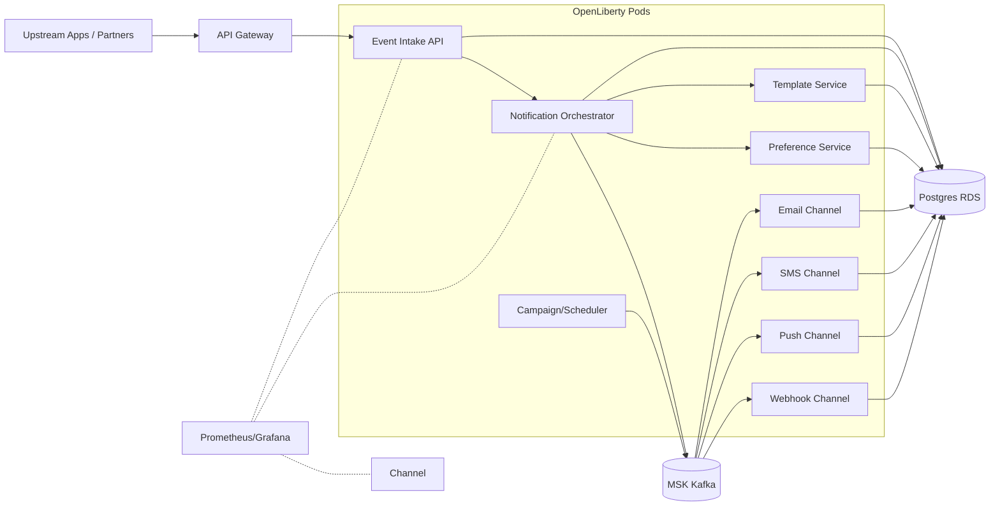
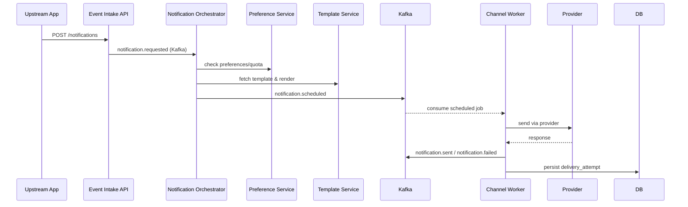
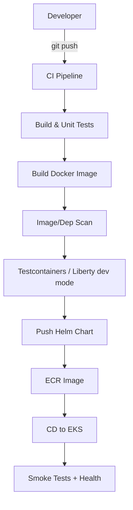

# Shipping Notification System – Implementation Guide

Comprehensive guide for building a shipping-notification platform using OpenLiberty, Jakarta EE 10, MicroProfile 6, CDI 3.0, JPA + QueryDSL, and Maven. Targets AWS with Docker/Kubernetes, Postgres, and Kafka.

## Goals
- Reliable, low-latency omni-channel notifications (email, SMS, push, webhook)
- Strong observability and delivery traceability (health, metrics, tracing, audits)
- Safe preference, throttling, and compliance controls (opt-in/out, quiet hours)
- Developer-friendly local setup and CI/CD pipeline

## Domain & Service Boundaries

| Service | Core responsibilities | Primary data | Events (Kafka) |
| --- | --- | --- | --- |
| Event Intake API | Accept notification requests (sync/async), validate payloads | Notification request | notification.requested |
| Notification Orchestrator | Route to channels, apply templates, preferences, throttling | Notification job, routing decision | notification.scheduled, notification.failed |
| Template Service | Manage templates, variables, localization, render previews | Template, locale variant | template.updated |
| Preference Service | Store user/tenant preferences, quiet hours, channels allowed | Preference, subscription | preference.updated |
| Channel Email/SMS/Push/Webhook | Deliver via provider, handle retries, DLQ | Delivery attempt, provider response | notification.sent, notification.delivered, notification.bounced |
| Campaign/Schedule | Batch sends, recurring notices, rate control | Campaign, schedule | campaign.started, campaign.completed |

### Data model starter (Postgres + JPA)

| Table | Key fields | Notes |
| --- | --- | --- |
| notification_request | id (UUID), tenant_id, recipient, channel_hint, template_id, payload_json, priority, correlation_id, status | Entry point record; status lifecycle: REQUESTED → SCHEDULED → SENT → DELIVERED/FAILED |
| notification_job | id, request_id (FK), channel, scheduled_at, attempt_no, status, next_attempt_at | Tracks retries/backoff per channel |
| delivery_attempt | id, job_id (FK), provider, status, provider_response, delivered_at | Auditable attempt log |
| template | id, code, locale, version, body, subject, channel, is_active | Use optimistic locking; versioning for rollout |
| preference | id, tenant_id, user_id, channel, opt_in, quiet_hours, frequency_cap | Enforce consent and rate limits |
| webhook_endpoint | id, tenant_id, url, secret, enabled, failure_count, last_failure_at | For partner callbacks; sign payloads |

## Architecture Overview



### Core delivery flow



## Service Design (per service)
- **API layer**: Jakarta RESTful WS (JAX-RS), JSON-B; accept batch and single send.
- **Application layer**: CDI orchestrates routing, preferences, throttling, and retries.
- **Domain layer**: Entities for notification request, job, template, preference; aggregates enforce opt-in and frequency caps.
- **Persistence**: JPA with QueryDSL for dynamic filters (status, channel, tenant, date ranges); optimistic locking on templates and preferences.
- **Messaging**: MicroProfile Reactive Messaging for Kafka; use DLQ topics per channel; apply exponential backoff and max-attempts.
- **Resilience**: MicroProfile Fault Tolerance (retry, timeout, circuit breaker, bulkhead) for provider calls and Kafka interactions.

## API Guidelines (REST)
- Versioned base path `/api/v1`.
- Resource examples:
  - `POST /notifications` to submit; returns request id + status URL.
  - `GET /notifications/{id}` for status and delivery attempts.
  - `POST /notifications/test` for dry-run rendering without send.
  - `PUT /templates/{code}/versions/{version}` to publish/update.
  - `GET /preferences/{userId}` and `PUT /preferences/{userId}` to manage opt-ins and quiet hours.
  - `POST /webhooks/{id}/rotate-secret` to rotate signing key.
- Errors: problem+json; always include `X-Correlation-Id` echo.
- Pagination: `limit`, `offset`; filtering for status, channel, tenant, date; sorting via `sort` param.

## Persistence with JPA + QueryDSL
- Generate Q-classes via Maven `apt-maven-plugin` or `querydsl-maven-plugin` in `generate-sources` phase.
- Use QueryDSL for dashboards and searches (e.g., failures per provider, deliveries per tenant/time window).
- Constraints: unique (`template(code, locale, version)`), FK consistency for jobs/attempts, check constraints for channel enums.
- Indexing: `(tenant_id, status)`, `(channel, status)`, `(correlation_id)`, `(recipient, channel)`, `(scheduled_at)`, `(preference.user_id, channel)`.

## Testing Strategy

| Layer | Tools | Scope |
| --- | --- | --- |
| Unit | JUnit 5 + Mockito | Rendering, throttling rules, preference checks, mappers |
| Persistence | JUnit + Testcontainers (Postgres) + QueryDSL predicates | Template versioning, dedupe, job queries |
| Contract/API | REST Assured | Notification submission, error shapes, pagination |
| Messaging | Testcontainers (Kafka) + WireMock for provider stubs | Retry/backoff, DLQ, idempotency keys |
| Integration | Arquillian or RestAssured against Liberty dev mode | End-to-end send + status retrieval |
| Observability | Assert health/metrics/traces endpoints | Liveness/readiness, custom meters per channel |

## Observability & Ops
- **Health**: MicroProfile Health for liveness/readiness; checks for DB, Kafka, external providers per channel.
- **Metrics**: MicroProfile Metrics; counters/gauges for requests accepted, sends by channel/provider, failure rate, queue lag, retries, throttling rejections.
- **Tracing**: MicroProfile Telemetry/OpenTelemetry; propagate correlation-id; trace through Kafka and channel calls.
- **Logging**: JSON logs with correlation-id, tenant-id, request-id; redact PII; ship via Fluent Bit/CloudWatch Logs.

## Security
- OAuth2/OIDC (Keycloak/Cognito) with MP JWT on JAX-RS; tenant scoping and RBAC for template/campaign changes.
- mTLS for provider webhooks (where supported) and between services if mesh enabled; certs via ACM.
- Sign outbound webhooks (HMAC) and verify inbound signatures; rotate secrets.
- Secrets via AWS Secrets Manager/K8s Secrets for provider creds; no secrets in images.
- Input validation with Bean Validation; payload size limits; rate limiting per tenant.

## CI/CD (Maven + Liberty)



Recommended stages:
1) `mvn -pl service -am verify` with unit + integration (Testcontainers Postgres/Kafka).
2) Build Liberty image (UBI base) with Jib or Docker; tag with commit SHA.
3) Scan (Trivy/Grype, OWASP DC) and SCA reports.
4) Publish image to ECR, Helm chart to artifact repo.
5) Deploy via Argo CD or GitHub Actions to EKS; run smoke/contract tests.

## Deployment on AWS (Kubernetes)
- **Compute**: EKS with autoscaling; node groups per workload (stateless vs. Kafka clients).
- **Data**: RDS Postgres (Multi-AZ), MSK for Kafka.
- **Networking**: API Gateway or ALB ingress; VPC endpoints for Secrets Manager; private subnets for services.
- **Config**: Helm values per env; ConfigMaps for non-secret config; Secrets for credentials/provider keys.
- **Scaling**: HPA on CPU/RAM/requests/sec; KEDA on Kafka consumer lag or queue depth per channel.
- **Backups**: RDS snapshots; MSK backups; export delivery logs to S3 if needed.

## Local Development
- Prereqs: JDK 17, Maven, Docker Desktop, kubectl/helm.
- Run stack via docker-compose/Testcontainers: Postgres, Kafka (Redpanda/Bitnami), WireMock for provider stubs.
- Use OpenLiberty dev mode (`mvn liberty:dev`) for hot reload.
- Seed data/migrations via Flyway or Liquibase (templates, sample preferences).

## Project Structure (multi-module Maven)
```
pom.xml (parent)
  common/                (shared DTOs, errors, tracing utilities)
  notification-service/  (intake + orchestrator API)
  template-service/
  preference-service/
  channel-email-service/
  channel-sms-service/
  channel-push-service/
  channel-webhook-service/
  campaign-service/
```
- Each service: `api` (JAX-RS), `application` (CDI use cases), `domain` (entities), `infra` (JPA/QueryDSL, messaging, config), `tests` (fixtures + Testcontainers).

## Quality Gates
- Code style: Spotless/Checkstyle.
- Coverage: JaCoCo > 80% on critical paths.
- Mutation testing (PIT) for domain rules (preferences, throttling).
- Dependency checks: OWASP DC; Dockerfile scans.

## Rollout & Resilience
- Blue/green or canary with Argo Rollouts.
- Schema changes via Liquibase/Flyway; use expand/contract for compatibility.
- Circuit breakers/timeouts for provider calls; bulkheads per channel consumer group.
- DLQs and replay tooling for Kafka topics; idempotency keys per notification request.

## Ready-to-Start Checklist
- [ ] Repositories created (per service) with parent POM
- [ ] CI pipeline with Maven verify + Testcontainers
- [ ] Docker base image chosen (OpenLiberty kernel) + Jib/Dockerfile
- [ ] Helm chart scaffolded with liveness/readiness probes per service
- [ ] RDS + MSK provisioned via IaC (Terraform/CloudFormation)
- [ ] Observability stack (Prometheus, Grafana, OTEL collector) deployed
- [ ] API error model, idempotency, and pagination standards agreed
- [ ] Security (OIDC provider, JWT validation, webhook signing) configured
