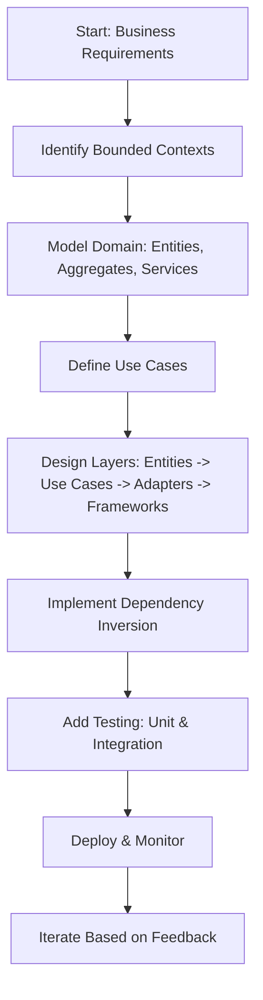
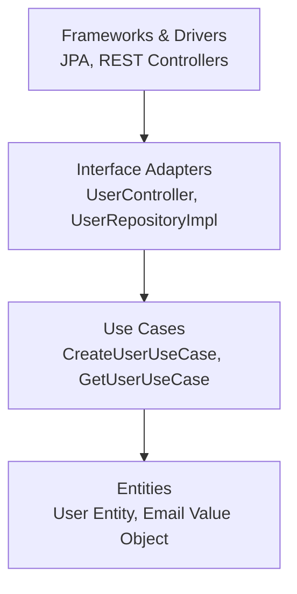
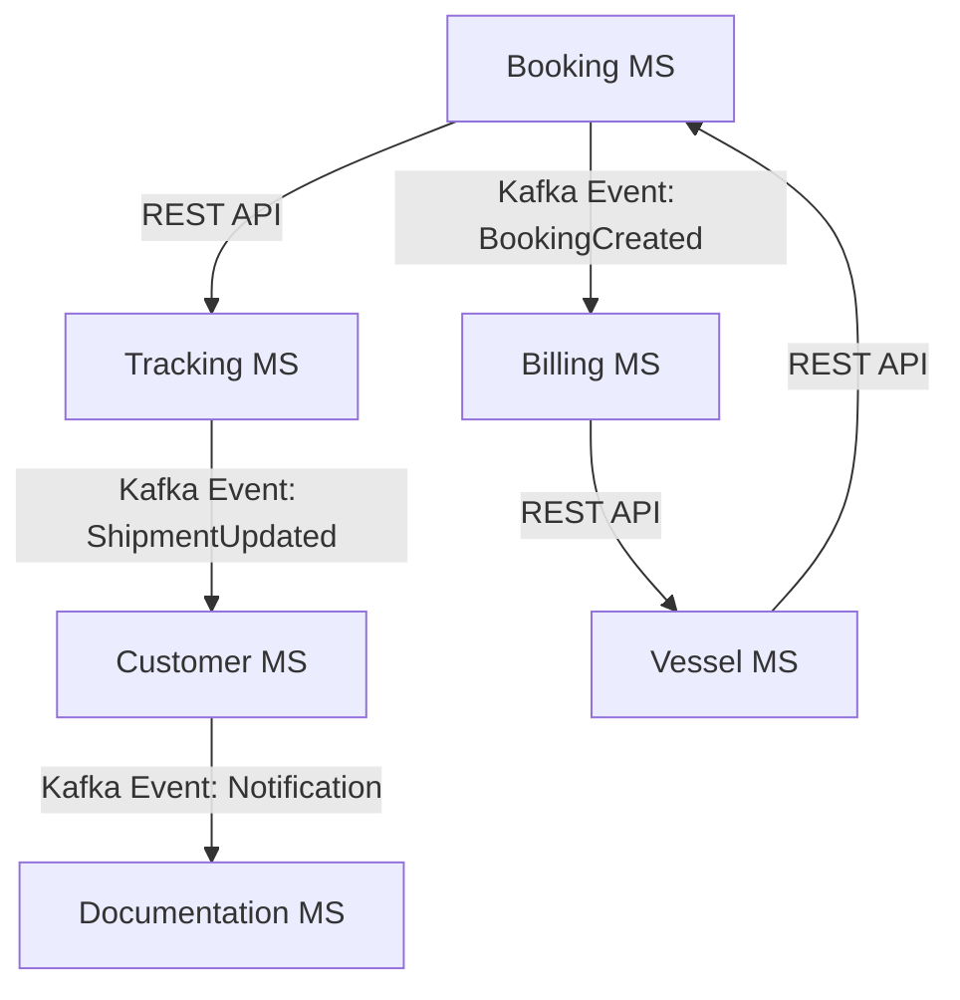
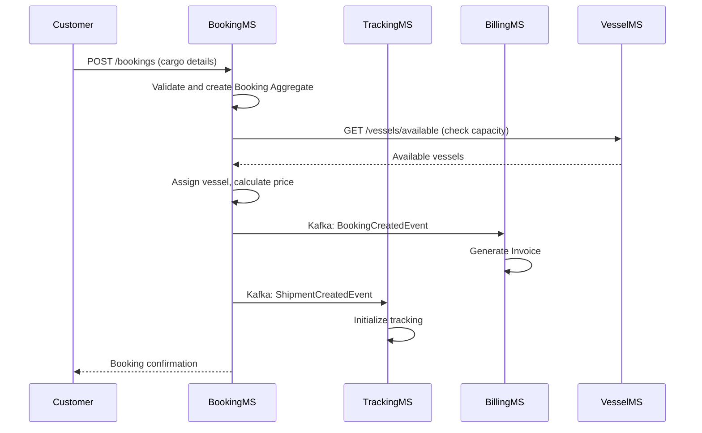

# Applying DDD and Clean Architecture to Microservice Development

## Question
The job description mentions Domain-Driven Design (DDD) and Clean Architecture. While your resume doesn't explicitly list these, your experience with microservices and complex business applications suggests you've likely encountered similar architectural principles. Can you discuss how you would apply DDD and Clean Architecture concepts to a new microservice development?

## Answer
Although my resume doesn't explicitly mention Domain-Driven Design (DDD) and Clean Architecture, my experience with microservices and complex business applications has involved principles that align closely with these approaches. For instance, in microservice architectures, I've focused on domain modeling, separation of concerns, and dependency inversion, which are core to DDD and Clean Architecture. In a new microservice development, I would apply these concepts to ensure maintainable, scalable, and testable code.

## Overview of DDD and Clean Architecture

### Domain-Driven Design (DDD)
DDD is an approach to software development that emphasizes modeling software around the business domain. Key concepts include:
- **Bounded Contexts**: Define clear boundaries for different parts of the domain.
- **Entities**: Objects with identity that change over time.
- **Value Objects**: Immutable objects defined by their attributes.
- **Aggregates**: Clusters of entities and value objects treated as a single unit.
- **Domain Services**: Operations that don't belong to a single entity.
- **Repositories**: Abstractions for data access.
- **Application Services**: Orchestrate domain objects for use cases.

### Clean Architecture
Proposed by Robert C. Martin, Clean Architecture organizes code into layers with dependencies pointing inward:
- **Entities**: Core business rules.
- **Use Cases**: Application-specific business rules.
- **Interface Adapters**: Controllers, gateways, presenters.
- **Frameworks & Drivers**: External frameworks like databases, web frameworks.

The goal is to make the system independent of external frameworks and easy to test.

### Mapping DDD to Clean Architecture

| DDD Concept            | Clean Architecture Layer | Description |
|------------------------|--------------------------|-------------|
| Entities/Value Objects | Entities                | Core domain objects with business rules. |
| Aggregates/Domain Services | Entities/Use Cases | Encapsulate domain logic and invariants. |
| Application Services   | Use Cases               | Orchestrate domain objects for application workflows. |
| Repositories           | Interface Adapters      | Abstractions for data persistence, implemented in outer layers. |
| Bounded Contexts       | Entire Microservice     | Each microservice represents a bounded context with its own layers. |

## Application to Microservice Development

In microservice development, each microservice can be seen as a bounded context in DDD, encapsulating a specific domain area. Clean Architecture provides the internal structure.

### Step-by-Step Approach

1. **Identify Bounded Context**:
   - Analyze the business domain to define the microservice's scope (e.g., User Management, Order Processing).

2. **Model the Domain (DDD)**:
   - Define entities, value objects, and aggregates.
   - Implement domain services for complex logic.

3. **Structure Layers (Clean Architecture)**:
   - **Entities Layer**: Pure domain objects without dependencies.
   - **Use Cases Layer**: Interactors that orchestrate domain logic.
   - **Interface Adapters Layer**: Controllers for REST APIs, repositories for data access.
   - **Frameworks Layer**: Database connections, external APIs.

4. **Dependency Inversion**:
   - Use interfaces in inner layers, implemented in outer layers (e.g., Repository interfaces in Use Cases, implemented in Adapters).

5. **Testing**:
   - Unit tests for entities and use cases.
   - Integration tests for adapters.

### Example: User Management Microservice

| Layer                  | Responsibilities                          | Technologies (Hapag-Lloyd Stack) |
|------------------------|-------------------------------------------|----------------------------------|
| Entities              | Business rules, domain objects           | Plain Java classes              |
| Use Cases             | Application logic, orchestrates entities | Java classes with CDI           |
| Interface Adapters    | Data transformation, external interfaces | JAX-RS Controllers, Repositories |
| Frameworks & Drivers  | Infrastructure, external tools           | IBM OpenLiberty, PostgreSQL, Kafka |

### Example Domains in Cargo Shipping (e.g., Hapag-Lloyd)

Applying DDD and Clean Architecture to a cargo shipping company like Hapag-Lloyd involves identifying key business domains and modeling them as bounded contexts. Each domain can be implemented as a microservice using the provided tech stack (Java/JakartaEE, IBM OpenLiberty, Maven, JUnit/Mockito/WireMock for testing, RESTful APIs, PostgreSQL/JPA/Kafka, AWS/Docker/Kubernetes, etc.). Below are several core domains with explanations:

#### 1. Booking Domain
- **Bounded Context**: Handles cargo booking requests, including origin/destination, cargo details, and scheduling.
- **Key Entities/Aggregates**: Booking (aggregate root), CargoItem (entity), Route (value object).
- **Domain Services**: PricingService for calculating rates.
- **Application in Tech Stack**: RESTful API endpoints for booking creation (JAX-RS), JPA for persistence in PostgreSQL, Kafka for publishing booking events to other domains.
- **Clean Architecture**: Entities for booking rules, Use Cases for booking workflows, Adapters for API and database integration.

#### 2. Tracking Domain
- **Bounded Context**: Manages shipment tracking, updates, and notifications.
- **Key Entities/Aggregates**: Shipment (aggregate root), TrackingEvent (entity), Location (value object).
- **Domain Services**: NotificationService for alerts.
- **Application in Tech Stack**: RESTful APIs for querying tracking info, Kafka for real-time event streaming, WireMock for testing external integrations.
- **Clean Architecture**: Use Cases for updating tracking, Adapters for event publishing and data retrieval.

#### 3. Billing Domain
- **Bounded Context**: Handles invoicing, payments, and financial settlements.
- **Key Entities/Aggregates**: Invoice (aggregate root), Payment (entity), Charge (value object).
- **Domain Services**: TaxCalculationService.
- **Application in Tech Stack**: RESTful APIs for payment processing, JPA with PostgreSQL for transaction storage, integration with external payment gateways.
- **Clean Architecture**: Entities for billing rules, Use Cases for invoice generation, Adapters for external API calls.

#### 4. Vessel Management Domain
- **Bounded Context**: Oversees fleet operations, schedules, and vessel assignments.
- **Key Entities/Aggregates**: Vessel (aggregate root), Schedule (entity), Port (value object).
- **Domain Services**: RouteOptimizationService.
- **Application in Tech Stack**: RESTful APIs for schedule updates, Kafka for broadcasting schedule changes, Docker/Kubernetes for containerized deployment.
- **Clean Architecture**: Use Cases for assigning vessels to shipments, Adapters for data synchronization.

#### 5. Customer Management Domain
- **Bounded Context**: Manages customer profiles, contracts, and relationships.
- **Key Entities/Aggregates**: Customer (aggregate root), Contract (entity), Contact (value object).
- **Domain Services**: LoyaltyService.
- **Application in Tech Stack**: RESTful APIs for profile management, JPA for customer data, integration with MS Teams/Jira for collaboration.
- **Clean Architecture**: Entities for customer rules, Use Cases for contract updates, Adapters for external CRM systems.

#### 6. Documentation Domain
- **Bounded Context**: Handles customs documents, certificates, and compliance.
- **Key Entities/Aggregates**: Document (aggregate root), Certificate (entity), Regulation (value object).
- **Domain Services**: ValidationService.
- **Application in Tech Stack**: RESTful APIs for document submission, Kafka for compliance event notifications, SonarQube for code quality in CI/CD.
- **Clean Architecture**: Use Cases for document processing, Adapters for regulatory API integrations.

These domains communicate via RESTful APIs or Kafka events, ensuring loose coupling. The tech stack supports this with OpenLiberty for lightweight deployment, Kubernetes for scaling, and Jenkins/ArgoCD for CI/CD pipelines.

### Inter-Microservice Communication Diagram

### Sequence Diagram: Booking a Shipment

### Challenges and Mitigations Table

| Challenge                  | Description | Mitigation |
|----------------------------|-------------|------------|
| Complexity Overhead       | Initial design requires significant planning | Use domain experts; start small and iterate |
| Team Coordination         | Aligning DDD with development teams | Regular workshops; shared ubiquitous language |
| Eventual Consistency      | Data synchronization across microservices | Use sagas or event sourcing; monitor with Grafana |
| Testing Across Boundaries | Integration testing for events/APIs | Employ WireMock for mocks; CI/CD with Jenkins |
| Performance               | Latency in inter-service calls | Optimize with Kubernetes; cache where appropriate |
| Scalability                | Handling varying loads | Auto-scale with Kubernetes; design for horizontal scaling |

### Benefits
- **Maintainability**: Clear separation allows changes without affecting other layers.
- **Testability**: Inner layers can be tested in isolation.
- **Scalability**: Microservices align with bounded contexts.
- **Flexibility**: Easy to swap implementations (e.g., database).

This approach ensures the microservice is robust, aligned with business needs, and adaptable to future changes.
