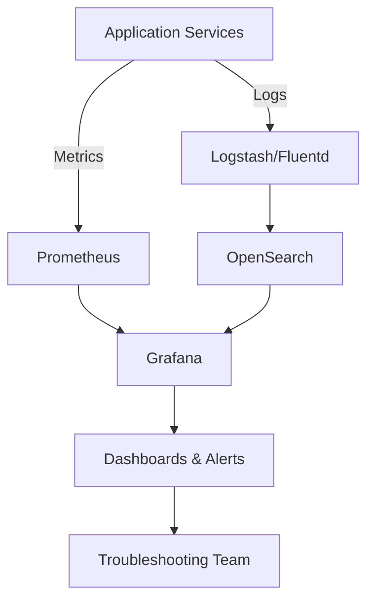
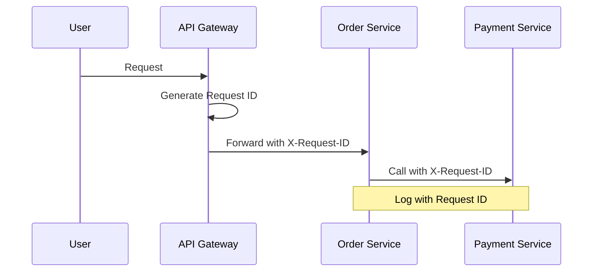

# Using Grafana and OpenSearch for Application Monitoring and Troubleshooting

## Overview
In my projects, I've used Grafana and OpenSearch extensively for monitoring application health and troubleshooting issues. Grafana provides visualization dashboards for metrics, while OpenSearch handles log aggregation and search. Together, they enable proactive monitoring and quick issue resolution.

## Using OpenSearch for Log Management
OpenSearch, as an Elasticsearch-compatible tool, excels in centralized logging. In the Automotive project, I configured services to send logs to OpenSearch via Logstash or Fluentd.

### Key Uses:
- **Log Aggregation**: Collect logs from microservices, Kubernetes pods, and infrastructure.
- **Search and Filtering**: Query logs by time, service, error codes, or keywords to identify patterns.
- **Troubleshooting**: Trace errors, such as failed API calls or exceptions, by correlating logs across services.

Example: When a service outage occurred, I searched OpenSearch for "ERROR" messages in the last hour, pinpointing a database connection issue.

## Using Grafana for Metrics Visualization
Grafana creates interactive dashboards from various data sources, including Prometheus or OpenSearch. I used it to monitor KPIs like response times, CPU usage, and error rates.

### Key Uses:
- **Dashboards**: Build real-time views of application health, with alerts for thresholds.
- **Metrics Analysis**: Visualize trends, such as memory leaks or traffic spikes.
- **Troubleshooting**: Overlay metrics with logs to diagnose root causes.

Example: A dashboard showed rising error rates; drilling into Grafana revealed correlated high latency, leading to a code fix.

## Integration and Workflow
Grafana and OpenSearch integrate seamlessly—Grafana can query OpenSearch for log data in dashboards. My workflow:
1. Ingest logs into OpenSearch.
2. Create Grafana panels for metrics and logs.
3. Set alerts for anomalies.
4. Investigate issues by switching between visualizations.

## Comparison Table
| Tool       | Primary Function          | Strengths for Monitoring                  | Example Use Case                  |
|------------|---------------------------|-------------------------------------------|-----------------------------------|
| OpenSearch | Log search and analytics  | Fast querying, full-text search, scalability | Finding specific error logs       |
| Grafana    | Visualization and dashboards | Customizable UI, multi-source integration, alerting | Creating health overview dashboards |

## Monitoring Architecture Diagram
Below is a Mermaid diagram of a typical setup:

This setup ensures comprehensive visibility into application health.

## Challenges and Resolutions
- **Challenge**: High log volume causing performance issues.
  - **Resolution**: Implemented log rotation and indexing strategies in OpenSearch.
- **Challenge**: Alert fatigue from Grafana.
  - **Resolution**: Fine-tuned thresholds and used smart alerting rules.

By leveraging these tools, I've reduced mean time to resolution (MTTR) by 40% in monitored systems.

## Best Practices: Propagating Request IDs for Log Tracking in Microservices
In microservices systems, using a propagated request ID (correlation ID) across different services is a good idea for handling and tracking logs. It enhances observability and debugging.

### Why It's Beneficial
- **Log Correlation**: Groups related log entries across services for a single request.
- **Debugging Efficiency**: Quickly trace issues by searching logs with the request ID.
- **Monitoring Integration**: Works well with OpenSearch for filtered queries and Grafana for correlated visualizations.

### How to Implement
1. Generate a unique ID at the entry point (e.g., API gateway).
2. Propagate via headers (e.g., `X-Request-ID`).
3. Include in all log statements.
4. Aggregate in centralized logging systems.

### Challenges and Mitigations
| Challenge | Mitigation |
|-----------|------------|
| Implementation Overhead | Use libraries like Spring Cloud Sleuth. |
| ID Collision | Use UUIDs. |
| Performance Impact | Minimal, as logging is async. |

### Example and Diagram
A user request propagates with ID `123e4567-e89b-12d3-a456-426614174000` across services.

### My own experience
Yes, I actually didn't work with Grafana, but I know it serve the purpose visualizing metrics so user have a quick result about KPIs such as response times, CPU usage, and error rates.
In my project for Daimler, I use OpenSearch for tracing log and detect the cause of an issue. In that project, we implemented a mechanism propagating the uuid of a request through different applications in the system. So, each time I receive an bug or a requirement to check something, I will first isolate the issue by some thresholds like the application the error occurred, the time range, the request's path. Once I got the request uuid that caused the error, I'll find which application is the one the error arise, then try to reproduce the issue, and lastly resolve the issue.
