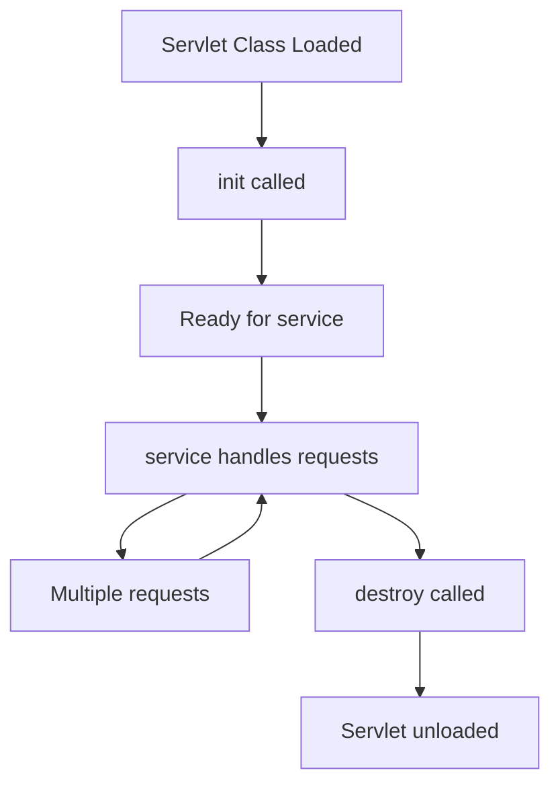
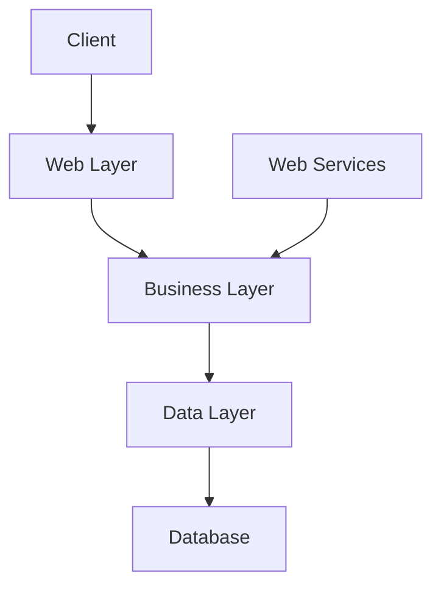

# Important Classes in Jakarta EE Beyond Entity

## Question
In Jakarta, beyond Entity class, what classes are also important ones?

## Answer
In Jakarta EE (formerly Java EE), beyond Entity classes (used in JPA for ORM), several other important classes and components include:

- **Servlets**: Handle HTTP requests/responses in web applications (e.g., `HttpServlet`). They process client requests, generate responses, and manage session state. Servlets have a lifecycle: init() → service() → destroy().
- **Enterprise JavaBeans (EJBs)**: For business logic, including Session Beans, Message-Driven Beans, and Entity Beans (though Entity Beans are deprecated in favor of JPA Entities). EJBs provide transaction management, security, and concurrency.
- **CDI (Contexts and Dependency Injection) Beans**: Managed beans for dependency injection and lifecycle management (e.g., `@Inject`, `@ApplicationScoped`). CDI enables loose coupling and manages bean scopes like request, session, application.
- **JAX-RS Resources**: For building RESTful web services (e.g., classes annotated with `@Path`). They define endpoints with annotations like `@GET`, `@POST`, supporting JSON/XML responses.
- **EntityManager**: Core JPA class for managing Entity lifecycles and queries. It handles CRUD operations, transactions, and caching for entities.
- **Filters and Listeners**: For intercepting requests (e.g., `Filter`, `ServletContextListener`). Filters modify requests/responses; listeners respond to events like application startup.
- **JPA Repositories/DAOs**: Custom classes for data access, often using `EntityManager`. They encapsulate queries and provide a clean interface for data operations.

These form the backbone of Jakarta EE applications for web, business, and data layers. If you mean specifically in the context of JPA or another area, provide more details!

### EJB Types Table

| Type              | Description | Example Use Case |
|-------------------|-------------|------------------|
| Session Bean     | Stateless/Stateful beans for business logic | User authentication service |
| Message-Driven Bean | Asynchronous message processing | Order processing from queues |
| Entity Bean      | Deprecated; replaced by JPA Entities | N/A |

### CDI Scopes Table

| Scope             | Description | Lifetime |
|-------------------|-------------|----------|
| @RequestScoped   | Per HTTP request | Single request |
| @SessionScoped   | Per user session | User session |
| @ApplicationScoped | Shared across app | Application lifetime |
| @Dependent       | Tied to injecting bean | Depends on parent |

### Servlet Lifecycle Diagram

## Detailed Overview

Jakarta EE is a set of specifications for enterprise Java applications. Below is a table summarizing key classes/components beyond Entities, categorized by layer.

| Category          | Class/Component | Description | Example Annotation/Usage | Ruby on Rails Equivalent | IBM OpenLiberty Feature/Configuration |
|-------------------|-----------------|-------------|--------------------------|--------------------------|-------------------------------------|
| **Web Layer**    | Servlet        | Handles HTTP requests/responses | `HttpServlet`, `doGet()` | Controller (inherits from `ApplicationController`, handles requests via actions like `index`, `show`) | `servlet-6.0` feature in server.xml |
| **Web Layer**    | Filter         | Intercepts and modifies requests/responses | `Filter`, `doFilter()` | Before/after action filters in controllers (e.g., `before_action :authenticate`), or Rack middleware | Included with `servlet-6.0` |
| **Web Layer**    | Listener       | Responds to lifecycle events | `ServletContextListener` | Initializers in `config/initializers/`, or lifecycle hooks in models/controllers | Included with `servlet-6.0` |
| **Web Services** | JAX-RS Resource| Builds RESTful APIs | `@Path`, `@GET` | Controller with RESTful routes (e.g., `resources :users` in routes.rb, actions like `index`, `create`) | `jaxrs-3.1` feature in server.xml |
| **Business Layer**| EJB Session Bean| Encapsulates business logic | `@Stateless`, `@Stateful` | Service classes (plain Ruby classes in `app/services/`), or model methods for business logic | `ejb-4.0` feature in server.xml |
| **Business Layer**| EJB Message-Driven Bean| Processes asynchronous messages | `@MessageDriven` | ActiveJob classes (inherit from `ApplicationJob`, for background processing via queues) | `ejb-4.0` with messaging features (e.g., `jms-3.0`) |
| **Dependency Injection**| CDI Bean | Manages dependencies and scopes | `@Inject`, `@RequestScoped` | Manual dependency injection or gems like `dry-container`; Rails uses conventions, not built-in DI like CDI | `cdi-4.0` feature in server.xml |
| **Data Layer**   | EntityManager  | Manages JPA entities | `persist()`, `find()` | ActiveRecord (models inherit from `ApplicationRecord`, methods like `save`, `find`) | `jpa-3.1` feature in server.xml |
| **Data Layer**   | Repository/DAO | Custom data access logic | Interfaces extending JPA | ActiveRecord models or custom query methods; no separate DAO layer, queries in models | Enabled via `jpa-3.1` and CDI for injection |

## Jakarta EE Architecture Diagram

## Key Specifications
- **Servlet API**: For web components.
- **EJB**: For enterprise beans.
- **CDI**: For dependency injection.
- **JAX-RS**: For REST services.
- **JPA**: For ORM (includes Entity and EntityManager).

These components enable scalable, maintainable enterprise applications. For JPA-specific details, refer to related documentation.
