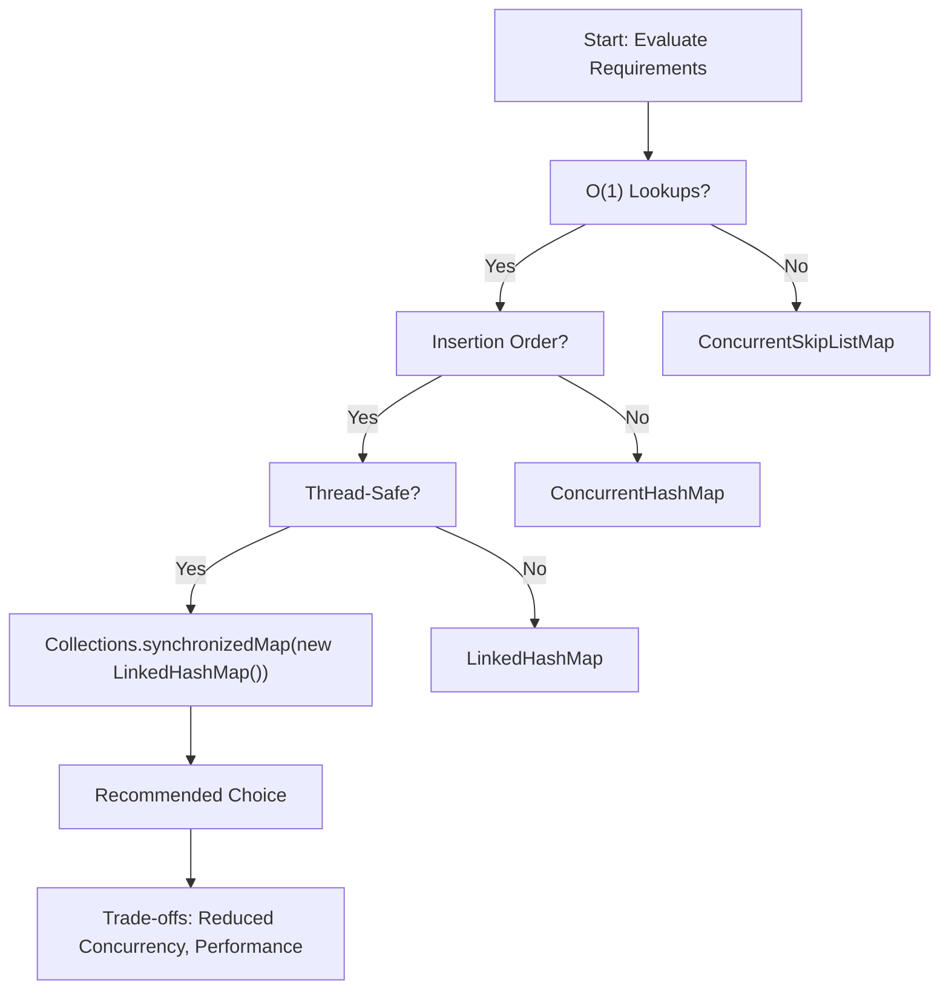
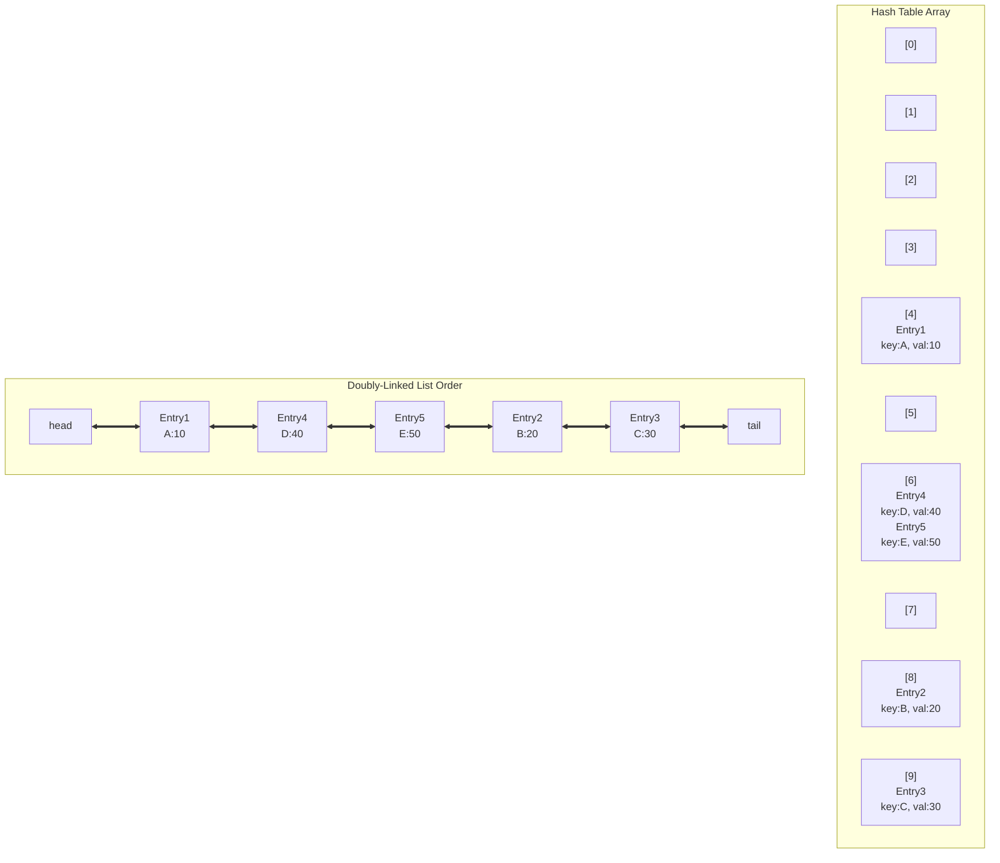
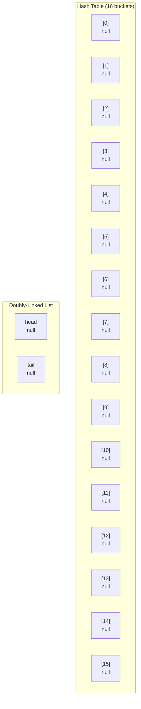
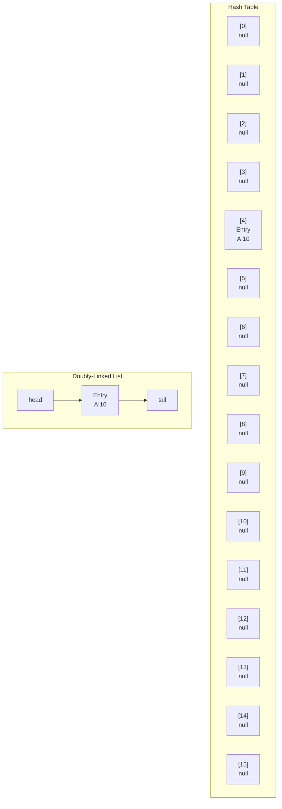
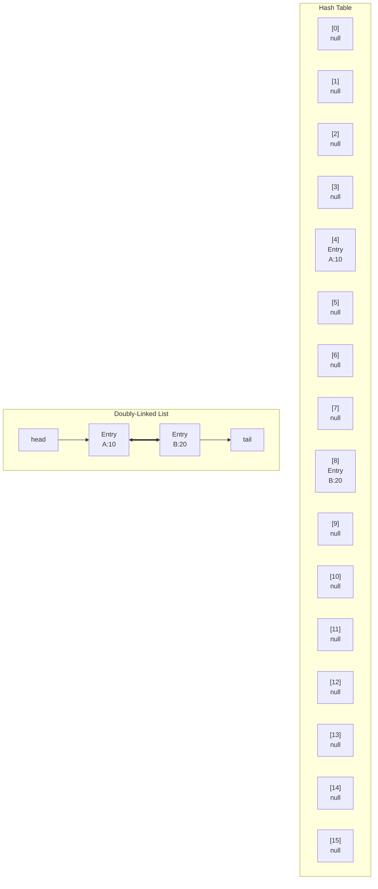

# Java Collection Choice for Specific Requirements

## Question
You need to store millions of records where:

- Lookups by key must be O(1)
- The insertion order must be preserved
- The collection will be accessed by multiple threads

Which Java collection(s) would you choose, and why?  
What trade-offs does your choice introduce?

## Analysis
The requirements demand a data structure that supports constant-time key-based lookups, maintains the order in which elements were inserted, and is safe for concurrent access by multiple threads. Let's evaluate the standard Java collections against these criteria.

### Key Requirements Breakdown
1. **O(1) Lookups by Key**: Requires a hash-based structure for average-case constant time complexity.
2. **Insertion Order Preservation**: The collection must maintain the sequence of insertions (not sorted order).
3. **Thread-Safety**: Must handle concurrent reads and writes without data corruption or race conditions.

### Java Collections Comparison

| Collection | O(1) Lookup | Insertion Order | Thread-Safe | Notes |
|------------|-------------|-----------------|-------------|-------|
| `HashMap` | Yes | No | No | Fastest for single-threaded use, but no order or thread-safety. |
| `LinkedHashMap` | Yes | Yes | No | Preserves insertion order, but not thread-safe. |
| `ConcurrentHashMap` | Yes | No | Yes | Thread-safe with high concurrency, but no order preservation. |
| `ConcurrentSkipListMap` | No (O(log n)) | No (sorted order) | Yes | Thread-safe and ordered, but lookups are logarithmic, not constant time. |
| `TreeMap` | No (O(log n)) | No (sorted order) | No | Sorted order, not insertion order. |
| `Collections.synchronizedMap(new LinkedHashMap<>())` | Yes | Yes | Yes | Wraps LinkedHashMap with synchronization. |

## Recommended Choice
I would choose **`Collections.synchronizedMap(new LinkedHashMap<>())`**.

### Why This Choice?
- **O(1) Lookups**: Inherits from `LinkedHashMap`, which uses hashing for constant-time key access.
- **Insertion Order**: `LinkedHashMap` maintains insertion order via a doubly-linked list.
- **Thread-Safety**: `Collections.synchronizedMap()` wraps the map with synchronized access, making all operations thread-safe.

This combination satisfies all three requirements using standard Java utilities.

## Trade-offs
- **Reduced Concurrency**: The synchronization locks the entire map for each operation, allowing only one thread to access it at a time. This can create a bottleneck in high-concurrency scenarios, unlike `ConcurrentHashMap` which allows concurrent reads and segmented writes.
- **Performance Overhead**: Synchronization introduces additional overhead compared to unsynchronized collections, potentially impacting throughput for write-heavy workloads.
- **No Built-in Concurrent Iteration**: Iterating over the map while it's being modified by other threads can throw `ConcurrentModificationException`, requiring external synchronization or careful usage.
- **Scalability**: For millions of records with high concurrent access, this may not scale as well as `ConcurrentHashMap`. Consider sharding or alternative data structures if performance becomes an issue.

## Alternative Considerations
If O(1) lookups are absolutely critical and some concurrency sacrifice is acceptable, `ConcurrentHashMap` could be used, but insertion order would need to be tracked separately (e.g., with a concurrent list), complicating the implementation.

For scenarios where order is more important than constant-time lookups, `ConcurrentSkipListMap` could be an option, but it doesn't preserve insertion order—only sorted order.

## Diagram: Decision Flow

## LinkedHashMap Internal Structure

LinkedHashMap combines a hash table with a doubly-linked list to achieve both O(1) lookups and insertion order preservation:

Key Components:
- **Hash Table (Buckets)**: Enables O(1) average-case lookups by key
- **Doubly-Linked List**: Maintains insertion order with prev/next pointers (shown as ↔)
- **Each Entry**: Contains key, value, hash code, and linked list pointers

### Detailed LinkedHashMap Structure Explanation

Let's break down how LinkedHashMap works step by step, starting from an empty map:

#### 1. Empty LinkedHashMap
When you create a new `LinkedHashMap<String, Integer> map = new LinkedHashMap<>()`:
- **Hash Table**: An array of buckets (initially 16 buckets, can grow)
- **Linked List**: Both `head` and `tail` pointers are `null`
- **Size**: 0 entries
- **No entries exist yet**

#### 2. Adding the First Element: `map.put("A", 10)`
- **Hash Calculation**: "A".hashCode() determines which bucket (let's say bucket 4)
- **Create Entry**: New Entry object with key="A", value=10, hash=..., next=null, prev=null
- **Hash Table Update**: Place the entry in bucket 4
- **Linked List Update**: Since it's the first entry:
  - Set `head = entry`
  - Set `tail = entry`
  - Entry's prev and next remain null

#### 3. Adding the Second Element: `map.put("B", 20)`
- **Hash Calculation**: "B".hashCode() determines bucket (let's say bucket 8)
- **Create Entry**: New Entry with key="B", value=20
- **Hash Table Update**: Place in bucket 8
- **Linked List Update**: 
  - Set current tail's (Entry A) next = new Entry B
  - Set new Entry B's prev = current tail (Entry A)
  - Set tail = new Entry B
  - New Entry B's next = null

#### How Lookups Work
- **get("A")**: Hash "A" → bucket 4 → find Entry(A,10) → return 10 (O(1))
- **Iteration**: Start from head → Entry(A,10) → Entry(B,20) → preserves insertion order

#### Key Points
- **Hash Table**: Provides fast O(1) access by key
- **Doubly-Linked List**: Maintains order and enables efficient iteration
- **Memory Overhead**: Each entry needs extra prev/next pointers (compared to HashMap)
- **Thread Safety**: Not thread-safe by default (use Collections.synchronizedMap for that)

### How LinkedHashMap Works

| Operation | Mechanism |
|-----------|-----------|
| **Insertion** | Hash function determines bucket → Entry added to bucket → Entry appended to end of linked list |
| **Lookup** | Hash function determines bucket → Search entry in that bucket → O(1) average case |
| **Iteration** | Traverse doubly-linked list head to tail → Returns entries in insertion order |
| **Memory** | Requires additional memory for linked list pointers (prev, next) |
