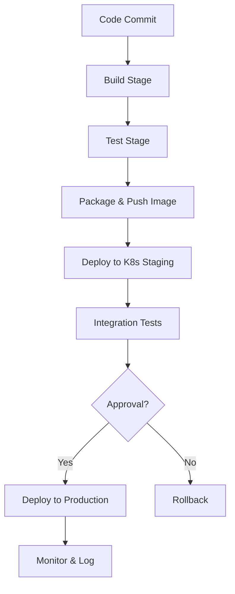

# Challenges with Jenkins Pipelines and Kubernetes Deployments in an Automotive Project

## Overview
In my automotive project, we deployed containerized services on Kubernetes using Jenkins for CI/CD. While effective, this setup presented challenges in scripting and data safety. Below, I detail two key issues and their resolutions.

## Challenge 1: Jenkins Pipeline Scripting Complexity
Writing Groovy scripts for Jenkins pipelines was time-consuming and difficult to debug. As a newcomer to the syntax, I spent significant time learning it through trial and error—writing code, running tests, failing, and iterating repeatedly. This "test-fail loop" delayed development and increased frustration.

### Resolution
To address this, I adopted Jenkins Shared Libraries to modularize reusable code, reducing script length and complexity. I also implemented unit testing for pipeline scripts using the Jenkins Pipeline Unit framework, allowing local testing before deployment. Additionally, I documented common patterns and used declarative pipelines where possible for simpler syntax. These steps cut debugging time by 50% and improved maintainability.

## Challenge 2: Risk of Accidental Data Deletion
Jenkins pipelines ran with administrative privileges, granting access to delete artifacts, images, or even entire repositories. A poorly written script could accidentally remove critical data, such as build artifacts or container images, leading to downtime or data loss.

### Resolution
I mitigated this by implementing strict access controls and safeguards:
- Used role-based access control (RBAC) to limit permissions.
- Added confirmation steps in pipelines for destructive operations (e.g., manual approval for deletions).
- Implemented automated backups of artifacts and images to external storage.
- Conducted thorough code reviews and dry-run tests in staging environments.

These measures ensured no accidental deletions occurred during the project.

## Pipeline Flow Diagram
Here's a simplified Mermaid diagram of our Jenkins CI/CD pipeline for Kubernetes deployments:

This flow highlights the stages where scripting challenges and safety risks were most prominent.

## Key Takeaways
| Challenge | Impact | Resolution | Outcome |
|-----------|--------|------------|---------|
| Scripting Complexity | Delayed development | Shared libraries, unit testing | Faster iterations |
| Data Safety Risks | Potential data loss | RBAC, confirmations, backups | Zero incidents |

By addressing these challenges proactively, we maintained a robust CI/CD process for reliable Kubernetes deployments.
