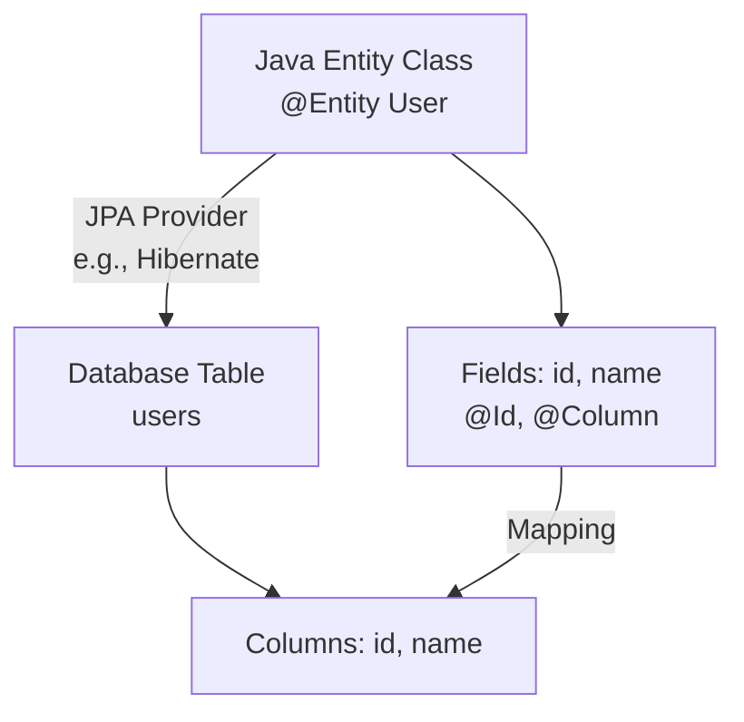
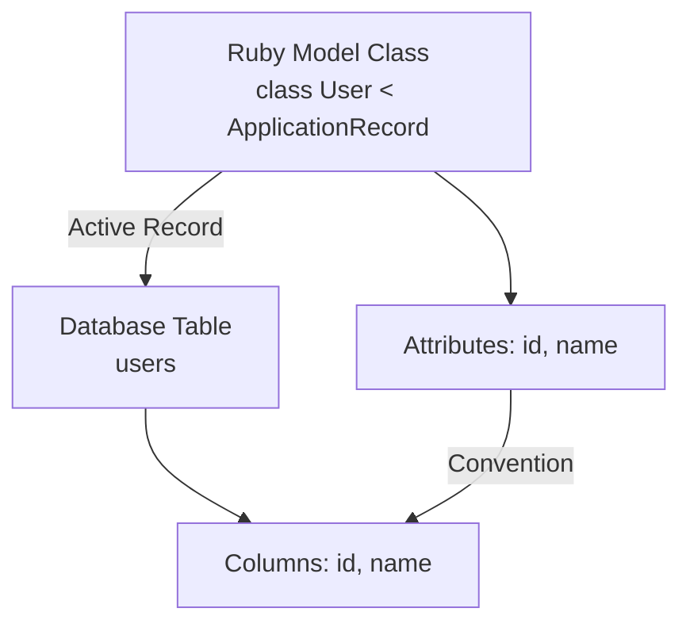
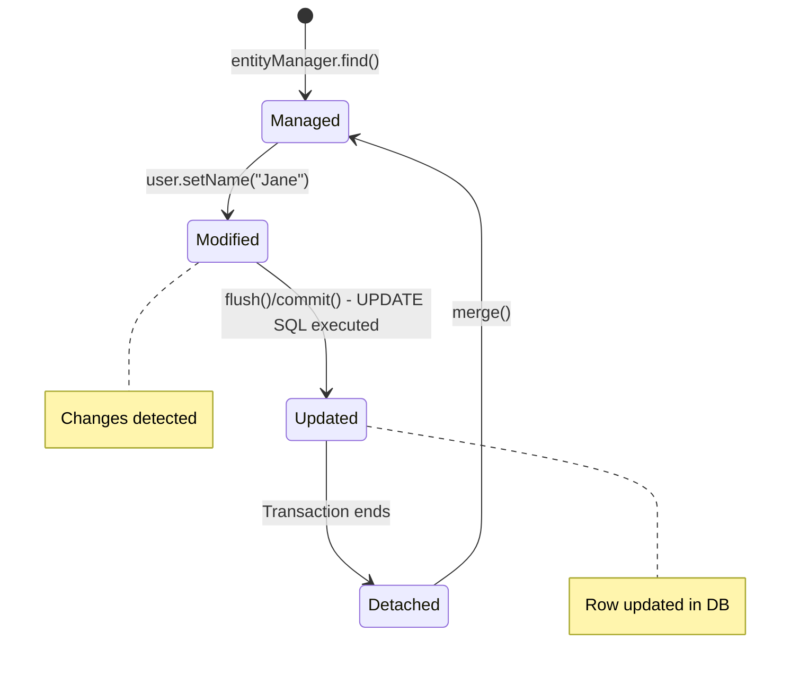
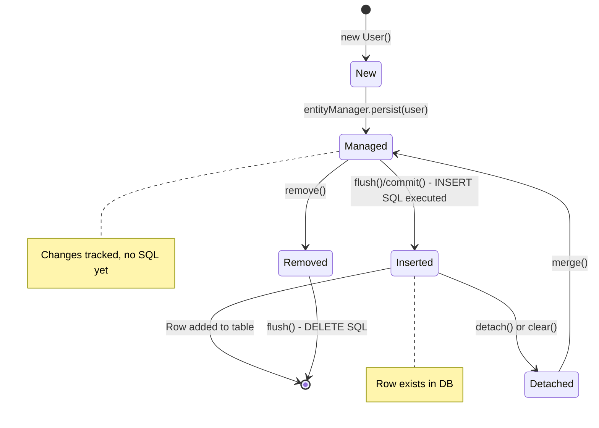
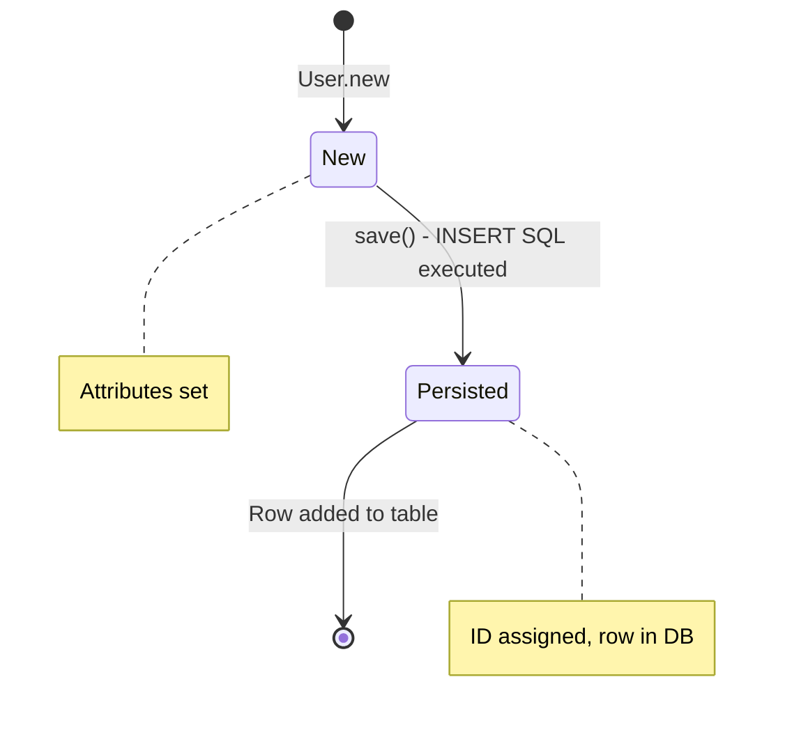
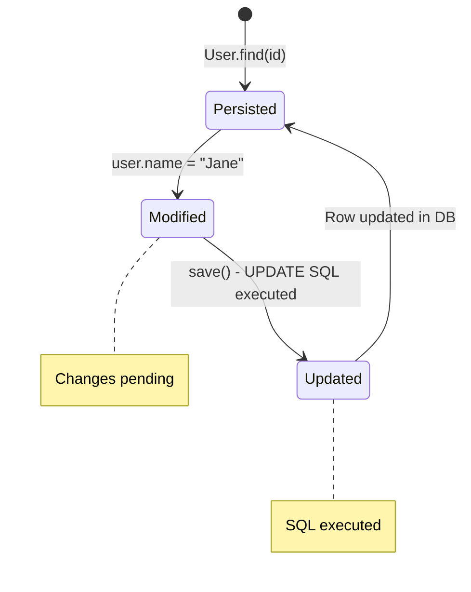
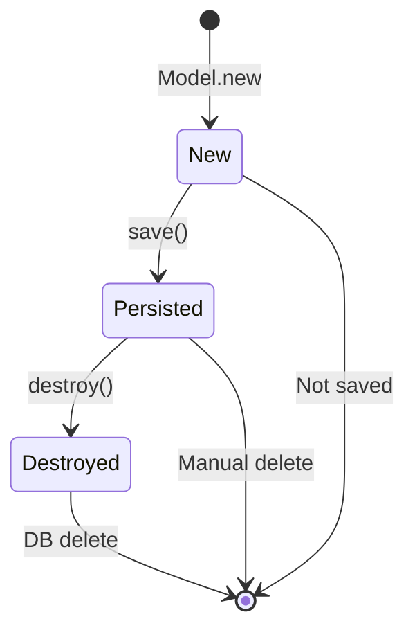

# JPA and Its Equivalent in Ruby on Rails

## Question
What is JPA, and what is similar to it in Ruby on Rails?

## Answer
JPA (Java Persistence API) is a specification in Java for object-relational mapping (ORM), allowing developers to manage relational data in Java applications using object-oriented paradigms. It provides a way to map Java objects to database tables, handle queries, and manage transactions without writing raw SQL.

In Ruby on Rails, the equivalent is **Active Record**, which is the default ORM framework. It follows the Active Record pattern, where each model class corresponds to a database table, and instances represent rows. Active Record simplifies database interactions by providing methods for CRUD operations, associations, validations, and migrations.

## Detailed Explanation

### JPA
- **Definition**: Part of the Jakarta EE (formerly Java EE) specification, JPA is an API for persisting Java objects to relational databases.
- **Key Features**:
  - Entity mapping with annotations like `@Entity`, `@Table`, `@Id`.
  - JPQL (Java Persistence Query Language) for database queries.
  - Lazy/eager loading, caching, and transaction management.
  - Providers like Hibernate implement JPA.
- **Usage**: Used in Java applications, especially with Spring Boot, to abstract database operations.

### Active Record in Ruby on Rails
- **Definition**: Active Record is Rails' built-in ORM that handles database interactions.
- **Key Features**:
  - Model classes inherit from `ApplicationRecord`.
  - Automatic mapping of class names to table names (e.g., `User` model to `users` table).
  - Associations like `has_many`, `belongs_to`.
  - Query methods like `find`, `where`, `save`.
  - Migrations for schema changes.
- **Usage**: Integral to Rails, enabling rapid development with conventions over configuration.

## Visual Overview

### JPA Object-Relational Mapping

### Active Record Mapping in Rails

## Entity/Model Lifecycle

### JPA Entity Lifecycle
JPA entities have states that determine their relationship with the persistence context:
- **New/Transient**: Not associated with any persistence context.
- **Managed/Persistent**: Associated with a context, changes are tracked.
- **Detached**: Was managed but no longer is.
- **Removed**: Scheduled for deletion.

#### Process for Adding a New Row to the Table
1. **Create Entity Instance**: Instantiate a new entity object (e.g., `User user = new User();`). It's in the **New** state, not yet linked to the database.
2. **Set Properties**: Populate the entity's fields (e.g., `user.setName("John");`).
3. **Persist the Entity**: Call `entityManager.persist(user);`. This transitions the entity to **Managed** state. The EntityManager now tracks changes, but no SQL is executed yet.
4. **Flush or Commit Transaction**: When `entityManager.flush()` or `transaction.commit()` is called, JPA generates and executes an INSERT SQL statement (e.g., `INSERT INTO users (name) VALUES ('John');`), adding the new row to the table. After commit, the transaction ends, and the entity transitions to **Detached** state (no longer managed by the EntityManager).

5. **Entity is Persisted**: The entity has an ID and the row exists in the database, but it's Detached unless re-associated with a new EntityManager.

If the transaction rolls back before flush, no row is added.

**Note**: The "Destroyed" state (equivalent to JPA's "Removed") is not part of the insertion process. It occurs separately when an entity is marked for deletion (e.g., via `entityManager.remove(entity)`), leading to a DELETE SQL execution.

#### Process for Updating an Existing Row in the Table
1. **Retrieve Entity**: Load an existing entity from the database (e.g., `User user = entityManager.find(User.class, id);`). It's in **Managed** state.
2. **Modify Properties**: Update the entity's fields (e.g., `user.setName("Jane");`). The EntityManager detects changes automatically.
3. **Flush or Commit Transaction**: When `entityManager.flush()` or `transaction.commit()` is called, JPA generates and executes an UPDATE SQL statement (e.g., `UPDATE users SET name = 'Jane' WHERE id = 1;`), updating the row in the table. After commit, the entity transitions to **Detached** state.
4. **Entity is Updated**: The database row reflects the changes, and the entity is Detached unless re-associated.

If starting with a Detached entity, use `merge()` first to re-attach it.

### Active Record Lifecycle in Rails
Active Record models have similar states:
- **new_record?**: Not saved to DB.
- **persisted?**: Saved and has ID.
- **destroyed?**: Marked for deletion.

#### Process for Creating a New Row in the Table
1. **Create Model Instance**: Instantiate a new model object (e.g., `user = User.new`). It's in the **new_record?** state, not yet linked to the database.
2. **Set Attributes**: Populate the model's attributes (e.g., `user.name = "John"`).
3. **Save the Model**: Call `user.save` or `user.save!`. This executes an INSERT SQL statement (e.g., `INSERT INTO users (name) VALUES ('John');`), adding the new row to the table. The model transitions to **persisted?** state.
4. **Model is Persisted**: The model now has an ID and is synchronized with the database.

If save fails (e.g., validation errors), the model remains new_record?.

#### Process for Updating an Existing Row in the Table
1. **Retrieve Model**: Load an existing model from the database (e.g., `user = User.find(id)`). It's in **persisted?** state.
2. **Modify Attributes**: Update the model's attributes (e.g., `user.name = "Jane"`).
3. **Save the Model**: Call `user.save` or `user.save!`. This executes an UPDATE SQL statement (e.g., `UPDATE users SET name = 'Jane' WHERE id = 1;`), updating the row in the table. The model remains in **persisted?** state.
4. **Model is Updated**: The database row reflects the changes.

If save fails, the model stays persisted? with unsaved changes.

## Comparison Table

| Aspect              | JPA (Java)                          | Active Record (Ruby on Rails)     |
|---------------------|-------------------------------------|----------------------------------|
| **Language**       | Java                               | Ruby                             |
| **Framework**      | Jakarta EE / Spring Boot           | Ruby on Rails                    |
| **Mapping**        | Annotations (e.g., @Entity)        | Conventions (class to table)     |
| **Query Language** | JPQL                               | Ruby methods / Arel              |
| **Transactions**   | Programmatic or declarative        | Automatic with Rails controllers |
| **Migrations**     | Liquibase / Flyway                 | Built-in Rails migrations        |
| **Associations**   | @OneToMany, etc.                   | has_many, belongs_to             |
| **Caching**        | Second-level cache                 | Built-in query caching           |
| **Learning Curve** | Steeper due to annotations         | Easier with Rails conventions    |

## Similarities
- Both are ORMs that abstract database operations.
- Support for CRUD, associations, and validations.
- Enable object-oriented database interactions.

## Differences
- JPA is specification-based with multiple implementations (e.g., Hibernate), while Active Record is tightly integrated into Rails.
- Rails emphasizes conventions, reducing boilerplate; JPA requires more configuration.
- Active Record is Ruby-specific, JPA is Java-centric.

This comparison highlights how both tools solve similar problems in their ecosystems, with Rails' Active Record offering more out-of-the-box simplicity.
