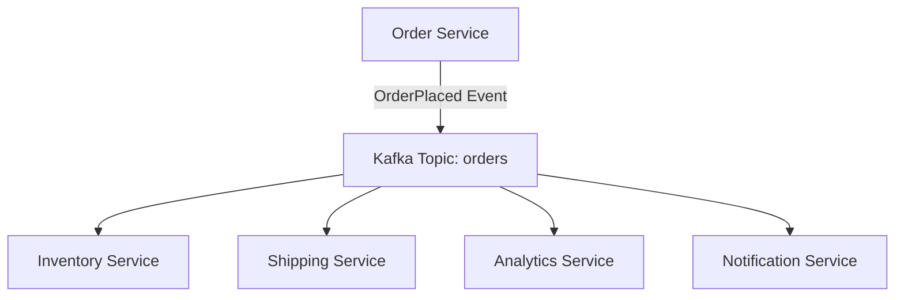
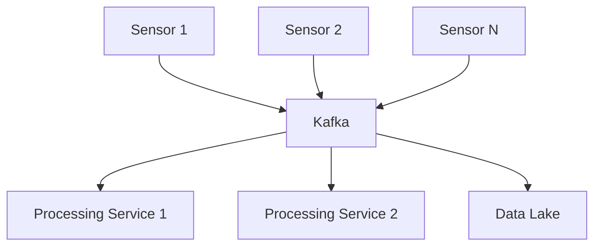
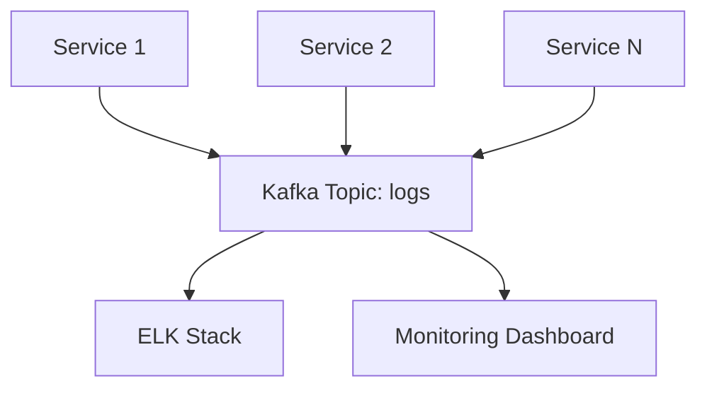
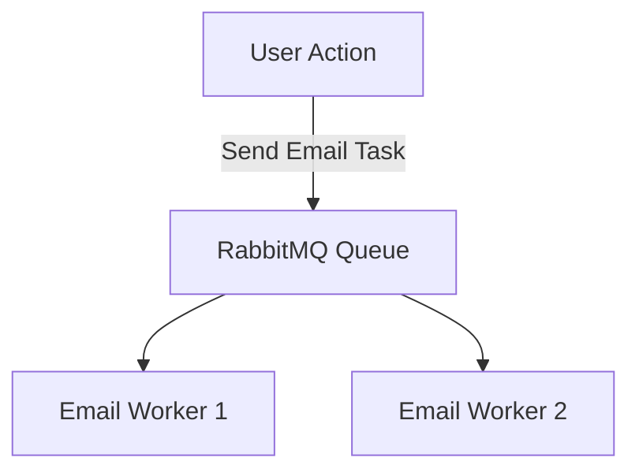
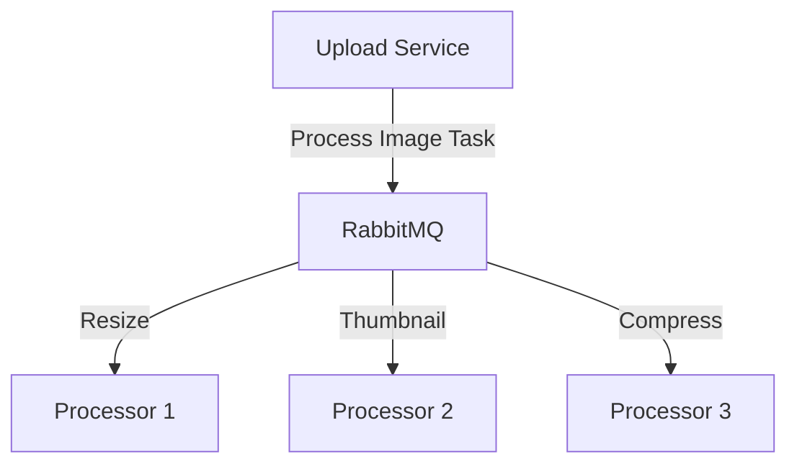
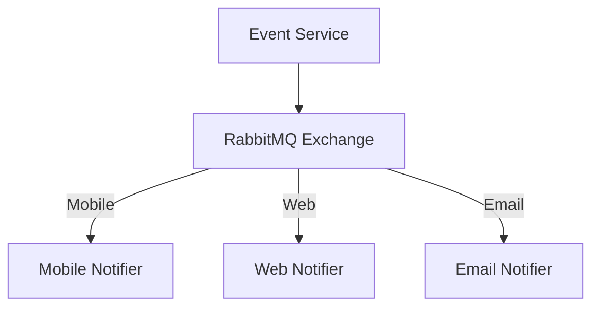
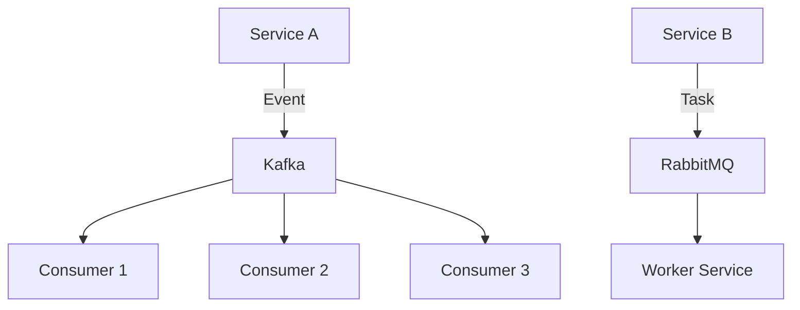

# Kafka vs RabbitMQ in Microservices Architecture

## Overview
In microservices architectures, asynchronous communication is key for decoupling services and improving scalability. Kafka and RabbitMQ are two popular tools for this, but they serve different purposes. Based on my experience, here's a clear comparison to help you choose the right one.

## Key Differences
Here's a quick table summarizing the main differences:

| Aspect              | Kafka                                      | RabbitMQ                                   |
|---------------------|--------------------------------------------|--------------------------------------------|
| **Type**           | Event streaming platform                  | Message broker                            |
| **Use Case**       | Event-driven systems, high-throughput data | Task/command-based, low-latency jobs      |
| **Durability**     | High (events are stored and replayable)   | Lower (messages are typically consumed once) |
| **Consumption**    | Multiple consumers can read independently | Usually one consumer per message          |
| **Latency**        | Slightly higher                           | Low                                       |
| **Complexity**     | Higher operational overhead               | Simpler to set up and manage              |
| **Routing**        | Topic-based                               | Advanced routing via exchanges            |

## When to Use Kafka
Kafka excels in scenarios where:
- **Events need to be durable and replayable**: Ideal for domain events, audit logs, or analytics where data might be reprocessed.
- **High throughput**: Handles large volumes of data efficiently, like in event sourcing or real-time pipelines.
- **Multiple consumers**: Services can consume events independently without affecting each other.

Example: Broadcasting user registration events to multiple services (e.g., email service, analytics, notifications).

## When to Use RabbitMQ
RabbitMQ is better for:
- **Task or command execution**: Background jobs, workflow steps, or request-driven processing where a message triggers a specific action.
- **Low latency**: Quick processing of messages, such as sending emails or updating caches.
- **Complex routing**: Using exchanges to route messages based on patterns (e.g., direct, topic, headers).

Example: Processing a payment command that needs to be handled by exactly one worker service.

## Rule of Thumb
- **Choose Kafka** if the message is an **event** (something that happened) that may be consumed by many services or replayed later.
- **Choose RabbitMQ** if the message is a **task/command** (something to do) that should be handled by one consumer quickly.

## Real-World Usage
In production, these tools often complement each other. Here are some detailed examples:

### Case 1: E-commerce Order Processing (Kafka)
When a user places an order, Kafka streams the "OrderPlaced" event to multiple services for decoupled processing.

### Case 2: IoT Data Streaming (Kafka)
Sensors send data to Kafka for real-time processing and storage.

### Case 3: Centralized Logging (Kafka)
Services log events to Kafka for aggregation and monitoring.

### Case 4: Email Sending Queue (RabbitMQ)
User actions trigger email tasks queued in RabbitMQ for asynchronous sending.

### Case 5: Image Processing (RabbitMQ)
Uploaded images are queued for background processing.

### Case 6: Push Notifications (RabbitMQ)
Events trigger notification tasks routed to appropriate handlers.

- Use **Kafka** for system-wide event streaming and integration (e.g., logging all service interactions).
- Use **RabbitMQ** for internal job queues and service coordination (e.g., retrying failed tasks).

## Architecture Diagram
Below is a simple Mermaid diagram illustrating a typical setup:

This shows Kafka handling events for multiple consumers and RabbitMQ managing tasks for a single worker.

My answer:
In my knowledge, both Kafka and RabbitMQ are suitable for applying asynchronous in a microservices architectures. However they are different in processing data and each one has its own advantages.
In brief. RabbitMQ is good in process task which is not happened while Kafka is good for process event which is done already. RabbitMQ has low latency and low durability while Kafka is slightly higher latency but high durability, therefore Kafka is suitable for stored events and will need replayable latter.
In summary, it's depend on the needs of functional and non functional requirements of a system, we should chose Kafka or RabbitMQ for our system.

For example, if we want process images and decouple the processing steps in different tasks, RabbitMQ is a good choice. When we want store and managing system logs, which may need to be replayable later, Kafka is better.
