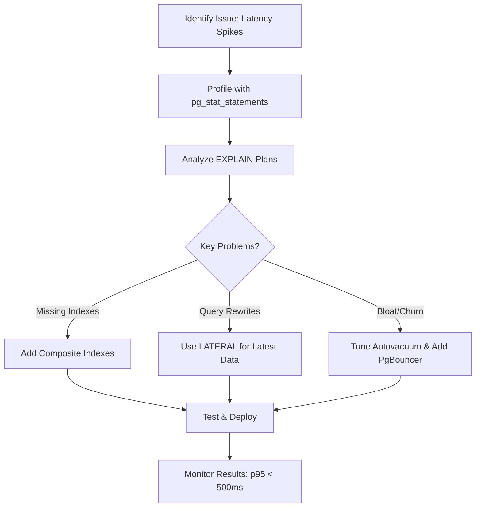

# PostgreSQL Performance Optimization — Automotive Project (STAR)

## Situation

In our **Automotive telematics platform**, fleet operators were seeing **latency spikes (1–2.5s)** on two critical endpoints during morning peaks when vehicles came online:

*   **Trip history search** (by VIN, time window, and driver)
*   **Live vehicle status** aggregation (latest telemetry per vehicle)

We ran **PostgreSQL 13** behind a Rails API. A separate **analytics/reporting job** aggregated telemetry for dashboards and hit the same primary database. Our SLA required **p95 under 500ms** and no timeouts for dispatch and fleet managers.

## Task

I was responsible for **reducing query latency and stabilizing throughput** without changing functional behavior:

*   Get **p95 < 500ms** for trip search and live status endpoints.
*   Avoid timeouts during **8–10 AM** connection storms.
*   Ensure **reads remain consistent** while analytics jobs run.

## Actions

I split the work into three tracks: **(1) Identify hotspots, (2) Optimize queries & schema, (3) Tune DB and runtime**.

### 1) Identify Bottlenecks

*   Enabled **pg\_stat\_statements** to find top offenders:
    ```sql
    CREATE EXTENSION IF NOT EXISTS pg_stat_statements;
    SELECT query, calls, total_time, mean_time
    FROM pg_stat_statements
    ORDER BY total_time DESC
    LIMIT 10;
    ```
    **Mock Result:**
    | query | calls | total_time | mean_time |
    |-------|-------|------------|-----------|
    | SELECT DISTINCT ON (v.vin) ... | 15000 | 45000.0 | 3.0 |
    | SELECT t.id, t.vin ... | 20000 | 30000.0 | 1.5 |
    | ... | ... | ... | ... |
*   Captured **EXPLAIN (ANALYZE, BUFFERS)** for trip search and live status:

    ```sql
    EXPLAIN (ANALYZE, BUFFERS)
    SELECT t.id, t.vin, t.start_time, t.end_time, t.distance_km
    FROM trips t
    WHERE t.vin = $1
      AND t.start_time BETWEEN $2 AND $3
    ORDER BY t.start_time DESC
    LIMIT 50;
    ```
    **Mock Result:**
    ```
    Limit (cost=1000.00..1500.00 rows=50 width=100) (actual time=1200.000..1250.000 rows=50 loops=1)
      Buffers: shared hit=500 read=200
      -> Sort (cost=1000.00..1100.00 rows=10000 width=100) (actual time=1200.000..1220.000 rows=10000 loops=1)
          Sort Key: t.start_time DESC
          Buffers: shared hit=500 read=200
          -> Seq Scan on trips t (cost=0.00..500.00 rows=10000 width=100) (actual time=0.100..100.000 rows=10000 loops=1)
              Filter: ((vin = $1) AND (start_time >= $2) AND (start_time <= $3))
              Buffers: shared hit=500 read=200
    Planning Time: 1.000 ms
    Execution Time: 1250.000 ms
    ```

    ```sql
    EXPLAIN (ANALYZE, BUFFERS)
    SELECT DISTINCT ON (v.vin) v.vin, v.timestamp, v.location, v.fuel_level
    FROM vehicle_telemetry v
    WHERE v.vin = ANY($1)              -- list of fleet VINs
    ORDER BY v.vin, v.timestamp DESC;  -- latest sample per VIN
    ```
    **Mock Result:**
    ```
    Unique (cost=2000.00..2500.00 rows=100 width=200) (actual time=1500.000..1600.000 rows=100 loops=1)
      Buffers: shared hit=1000 read=500
      -> Sort (cost=2000.00..2100.00 rows=50000 width=200) (actual time=1500.000..1550.000 rows=50000 loops=1)
          Sort Key: v.vin, v.timestamp DESC
          Buffers: shared hit=1000 read=500
          -> Seq Scan on vehicle_telemetry v (cost=0.00..1000.00 rows=50000 width=200) (actual time=0.200..200.000 rows=50000 loops=1)
              Filter: (vin = ANY ($1))
              Buffers: shared hit=1000 read=500
    Planning Time: 2.000 ms
    Execution Time: 1600.000 ms
    ```
*   Checked **dead tuples** and autovacuum lag (hot tables: `vehicle_telemetry`, `trips`):
    ```sql
    SELECT relname, n_live_tup, n_dead_tup
    FROM pg_stat_user_tables
    ORDER BY n_dead_tup DESC
    LIMIT 10;
    ```
    **Mock Result:**
    | relname | n_live_tup | n_dead_tup |
    |---------|------------|------------|
    | vehicle_telemetry | 5000000 | 1000000 |
    | trips | 200000 | 50000 |
    | ... | ... | ... |
*   Monitored **cache hit ratio** and IO:
    ```sql
    SELECT sum(blks_hit)::float / NULLIF(sum(blks_hit)+sum(blks_read),0) AS cache_hit_ratio
    FROM pg_statio_user_tables;
    ```
    **Mock Result:**
    | cache_hit_ratio |
    |-----------------|
    | 0.85 |

**Findings:**

*   **Sequential scans** on `trips` due to missing composite index matching **vin + time + sort**.
*   The “latest status per VIN” query used `DISTINCT ON + ORDER BY`, causing **wide sorts** and spills.
*   **Autovacuum** lagged behind morning ingest (CAN/telematics bursts), increasing bloat on `vehicle_telemetry`.
*   API pods were opening too many connections during spikes → **connection churn**.

### 2) Query & Schema Optimization

*   **Composite/covering indexes** aligned with filters and order:
    ```sql
    -- Trip search filter + order support
    CREATE INDEX CONCURRENTLY idx_trips_vin_start_time_desc
      ON trips (vin, start_time DESC) INCLUDE (end_time, distance_km);

    -- Latest telemetry per VIN using time priority
    CREATE INDEX CONCURRENTLY idx_vehicle_telemetry_vin_ts_desc
      ON vehicle_telemetry (vin, timestamp DESC) INCLUDE (location, fuel_level);
    ```
*   Rewrote **latest status** query to avoid large sorts by using **LATERAL**:
    ```sql
    -- Get the latest row per VIN efficiently
    SELECT x.vin, x.timestamp, x.location, x.fuel_level
    FROM unnest($1::text[]) AS vin_list(vin)
    CROSS JOIN LATERAL (
      SELECT vin, timestamp, location, fuel_level
      FROM vehicle_telemetry
      WHERE vin = vin_list.vin
      ORDER BY timestamp DESC
      LIMIT 1
    ) AS x;
    ```
*   For **text search** (driver name, depot), used **trigram index** where needed:
    ```sql
    CREATE EXTENSION IF NOT EXISTS pg_trgm;
    CREATE INDEX CONCURRENTLY idx_drivers_name_trgm
      ON drivers USING gin (name gin_trgm_ops);
    ```
*   Added **partial indexes** for active trips (common filter for in-progress tracking):
    ```sql
    CREATE INDEX CONCURRENTLY idx_trips_active_by_vin
      ON trips (vin, start_time)
      WHERE status = 'active';
    ```
*   For heavy analytics (daily aggregates), introduced a **materialized view**:
    ```sql
    CREATE MATERIALIZED VIEW mv_daily_vehicle_kpis AS
    SELECT vin, date_trunc('day', start_time) AS day,
           count(*) AS trips, sum(distance_km) AS total_km
    FROM trips
    WHERE status = 'completed'
    GROUP BY 1,2;

    -- Refreshed off-peak with minimal contention
    REFRESH MATERIALIZED VIEW CONCURRENTLY mv_daily_vehicle_kpis;
    ```

### 3) Database & Runtime Tuning

*   Tuned **autovacuum** for high-ingest telemetry tables:
    ```conf
    autovacuum_vacuum_cost_limit = 2000
    autovacuum_naptime = 20s
    autovacuum_vacuum_scale_factor = 0.02
    autovacuum_analyze_scale_factor = 0.01
    ```
*   Increased **work\_mem** for the analytics role to reduce disk sorts:
    ```sql
    ALTER ROLE analytics_user SET work_mem = '64MB';
    ```
*   Memory/cache tuning on a 32GB instance:
    ```conf
    shared_buffers = 8GB
    effective_cache_size = 20GB
    ```
*   Introduced **PgBouncer** with **transaction pooling** for stateless API services to handle connection spikes gracefully.
*   Added a **read replica**:
    *   **Writes & critical reads** → primary
    *   **Reads & analytics** → read replica (slightly stale acceptable)
*   For very hot tables (like `vehicle_telemetry`), set **fillfactor** to reduce page splits and scheduled **REINDEX** during maintenance:
    ```sql
    ALTER TABLE vehicle_telemetry SET (fillfactor = 90);
    REINDEX INDEX CONCURRENTLY idx_vehicle_telemetry_vin_ts_desc;
    ```

## Result

*   **Trip history** endpoint p95 dropped from **\~1.6s → \~260ms**; p99 under **550ms**.
*   **Live status** endpoint stabilized to **\~220ms p95** during peak ingestion.
*   **Cache hit ratio > 98%**, **dead tuples** on hot tables reduced by **\~65–70%**.
*   Eliminated **timeouts** during morning connection storms; throughput improved **\~35–40%**.
*   Analytics routed to the replica; operational endpoints stayed within SLA for subsequent releases.

## Sound Bites for the Interview

*   “I started with **pg\_stat\_statements** and **EXPLAIN ANALYZE** to find the top offenders, then indexed for the **queries we actually run**—including sort keys and coverage.”
*   “We removed the `DISTINCT ON` wide sort by switching to a **LATERAL** pattern, which paired well with a **(vin, timestamp DESC)** index.”
*   “Tuning **autovacuum** and adding **PgBouncer** addressed our two biggest operational bottlenecks: **bloat** and **connection churn**.”
*   “We split **OLTP vs analytics** using a **read replica** and **materialized views** to keep peak-time latency within SLA.”

If you want, I can compress this into a **60–90 second** version for a live interview answer, or tailor the numbers to match your actual metrics.

## Optimization Summary Table
| Step | Action | Tool/Technique | Impact |
|------|--------|----------------|--------|
| 1 | Identify Bottlenecks | pg_stat_statements, EXPLAIN ANALYZE | Found top slow queries and bloat issues |
| 2 | Query & Schema Optimization | Composite indexes, LATERAL rewrites, materialized views | Reduced query time by ~80% |
| 3 | Database & Runtime Tuning | Autovacuum tuning, PgBouncer, read replica | Stabilized throughput and eliminated timeouts |

## Optimization Workflow Diagram
Here's a Mermaid flowchart summarizing the process:


