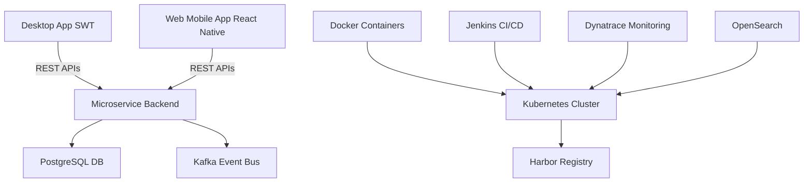
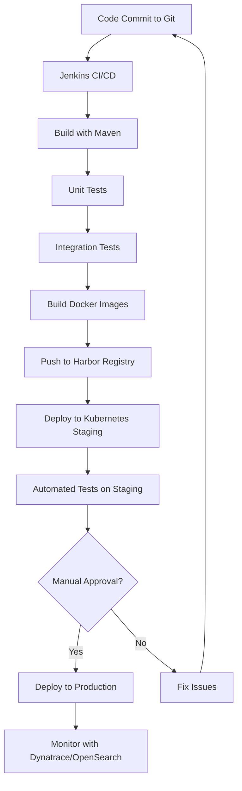

# SWT Automotive Project

## Project Overview
This project involved the development of a desktop and web application for a German customer (SWT) targeting an automotive company. The team consisted of 15 members, focusing on full-stack development. The application serves technicians by providing tools for comparing and analyzing embedded software, hardware, and firmware configurations across vehicle models, enabling informed decisions on component upgrades.

## Responsibilities
As a Full-stack Developer, key responsibilities included:
- **Desktop Application Development**: Designed and developed the desktop application using Standard Widget Toolkit (SWT), implementing an expert system for configuration comparison and analysis.
- **Backend Architecture**: Migrated from a monolithic to a microservice-based architecture, building RESTful APIs for system integration.
- **Algorithm Implementation**: Developed comparison algorithms for vehicle configuration analysis to identify discrepancies and required upgrades.
- **Deployment and Infrastructure**: Deployed containerized services on Kubernetes clusters, ensuring scalability and reliability.
- **Collaboration**: Worked closely with Requirement Engineers and Product Owners to refine business and technical requirements, ensuring alignment with user needs.
- **Workflow Analysis**: Analyzed and optimized workflow processes of the desktop application to improve efficiency.

## Technologies Used
The project leveraged a modern tech stack for robust, scalable development:

| Category              | Technologies |
|-----------------------|--------------|
| **Programming Languages** | Java |
| **Desktop Framework** | Standard Widget Toolkit (SWT) |
| **Web/Mobile Development** | React Native (for cross-platform) |
| **Backend Framework** | Spring Boot (microservices) |
| **Database**          | PostgreSQL (with Liquibase migrations) |
| **Containerization**  | Docker |
| **Orchestration**     | Kubernetes |
| **Registry**          | Harbor |
| **CI/CD**             | Jenkins pipelines |
| **Monitoring**        | Dynatrace |
| **Logging/Analytics** | OpenSearch |

## Architecture Overview
The application follows a microservice architecture post-migration, with a desktop client and web/mobile interfaces.

## CI/CD Pipeline
The project utilized Jenkins for continuous integration and continuous deployment, ensuring automated and reliable delivery of both desktop and microservice components.

### CI/CD Flow Description
1. **Code Commit**: Developers push code to the Git repository.
2. **Build**: Jenkins triggers builds for Java/Spring Boot microservices and desktop app components.
3. **Unit Testing**: Run JUnit tests for backend, and appropriate tests for desktop.
4. **Integration Testing**: Test microservice interactions and APIs.
5. **Containerization**: Build Docker images for microservices.
6. **Push to Registry**: Images pushed to Harbor registry.
7. **Deployment**: Automated deployment to Kubernetes clusters for staging/production.
8. **Monitoring**: Dynatrace monitors performance, OpenSearch logs issues.

### Key Aspects
- **Automation**: Full pipeline automation reduces manual errors.
- **Multi-Environment**: Separate staging and production deployments.
- **Quality Gates**: Tests and approvals ensure quality.
- **Integration**: Ties into Kubernetes for scaling and Harbor for image management.

### Key Components
- **Desktop Expert System**: Built with SWT for offline analysis of vehicle configurations.
- **Microservices**: Modular backend services handling business logic, data processing, and API endpoints.
- **RESTful APIs**: Enable integration between desktop, web, and external systems.
- **Database Layer**: PostgreSQL with Liquibase for schema mig
rations and data consistency.
- **Containerization**: Docker for packaging, Kubernetes for orchestration and scaling.
- **CI/CD Pipeline**: Jenkins for automated builds, tests, and deployments.
- **Monitoring and Logging**: Dynatrace for performance monitoring, OpenSearch for log analysis.

## Challenges and Solutions
- **Migration Complexity**: Migrating from monolithic to microservices required careful decomposition. Solution: Incremental migration with thorough testing.
- **Cross-Platform Compatibility**: Ensuring desktop and web apps work seamlessly. Solution: Used React Native for mobile/web and SWT for desktop.
- **Scalability**: Handling automotive data volumes. Solution: Kubernetes auto-scaling and efficient algorithms.
- **Integration**: Coordinating with automotive systems. Solution: Robust REST APIs and event-driven communication.

## Outcomes
- Delivered a comprehensive tool for vehicle technicians, reducing upgrade decision time.
- Improved system maintainability through microservices.
- Enhanced deployment reliability with containerization and CI/CD.
- Fostered collaboration across teams for requirement refinement.

This project demonstrates expertise in full-stack development, architectural migration, and modern DevOps practices in a domain-specific context.
