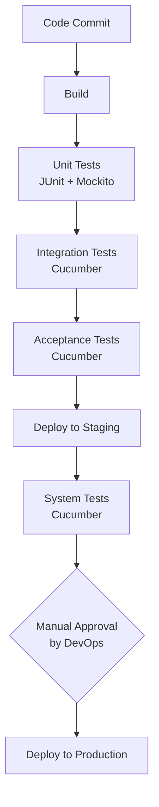

# Testing Methodologies in CI/CD Pipeline

## Question
You've listed JUnit and Mockito in your skills and used Cucumber with Gherkin in your Telecommunications project. How do you see these testing methodologies complementing each other in a CI/CD pipeline, especially when working with RESTful APIs?

## Answer
JUnit and Mockito, or Cucumber with Gherkin, are different testing tools that are suitable for different testing goals. While JUnit and Mockito are generally used for unit tests that isolate the code we want to verify and test it with given data, Cucumber with Gherkin is a Behavior-Driven Development (BDD) tool that can automate any level of testing. However, in practice, Cucumber with Gherkin is recommended for Acceptance/System tests that perform end-to-end testing from user login through business behaviors, or Integration testing that calls different APIs from other modules. Cucumber with Gherkin is not ideal for Unit Testing as it is slower and requires more effort to implement the tests.

## Overview of Testing Tools

### JUnit
JUnit is a popular open-source framework for writing and running unit tests in Java. It provides annotations like `@Test`, `@Before`, `@After` to structure tests, and assertions to verify expected outcomes. JUnit 5 (Jupiter) introduces modern features like parameterized tests and dynamic tests.

### Mockito
Mockito is a mocking framework that allows creating mock objects to simulate dependencies in unit tests. It helps isolate the code under test by stubbing external services, databases, or APIs. Key features include `@Mock` annotations, `when().thenReturn()` for stubbing, and verification of method calls.

### Cucumber with Gherkin
Cucumber is a BDD framework that uses Gherkin, a plain-text language, to write executable specifications. Gherkin scenarios describe behavior in "Given-When-Then" format, making tests readable by non-technical stakeholders. Cucumber integrates with various programming languages and can drive UI, API, or integration tests.

## Comparison Table

| Aspect              | JUnit + Mockito                  | Cucumber + Gherkin               |
|---------------------|----------------------------------|----------------------------------|
| **Testing Level**  | Unit Testing                     | Integration, Acceptance, System |
| **Focus**          | Code isolation, logic validation | End-to-end user scenarios       |
| **Speed**          | Fast (seconds)                   | Slower (minutes)                |
| **Ease of Use**    | Developer-focused, code-heavy    | Business-readable, collaborative|
| **Maintenance**    | Low effort for code changes      | Higher effort for feature changes|
| **Best For**       | Individual methods/classes       | Full workflows, API chains      |
| **RESTful API Use**| Mocking API responses            | Testing API sequences           |

## Complementarity in CI/CD Pipeline

In a CI/CD pipeline, these testing methodologies work together to ensure comprehensive coverage and efficient delivery. The pipeline typically includes stages like build, test, deploy, with testing phases running in parallel or sequence.

For systems where deployment to production is triggered manually by DevOps (e.g., for compliance or risk mitigation), the flow adjusts as follows:

This setup is still considered **Continuous Delivery** (not Continuous Deployment), as the code is always in a deployable state up to staging, but production deployment requires human intervention. Continuous Delivery ensures that software can be released reliably at any time, while Continuous Deployment automates the entire process including production.

- **Unit Testing (JUnit + Mockito)**: Run early in the pipeline after build. Provide fast feedback on individual components. For RESTful APIs, mock external dependencies (e.g., databases, third-party services) to test controllers, services, and data layers in isolation. Example: Testing a GET endpoint logic without hitting the actual database.

- **Integration Testing**: Use Cucumber to test interactions between components, such as API calls to external services or database integrations. Ensures that mocked dependencies in unit tests behave correctly in real environments.

- **Acceptance/System Testing**: Cucumber excels in end-to-end scenarios, simulating real user journeys that involve multiple API calls, authentication, and business logic validation. For RESTful APIs, this might include testing a full user flow: login (POST /auth), retrieve data (GET /users), update profile (PUT /users/{id}).

This layered approach ensures issues are caught early (unit tests), interactions work correctly (integration), and the system meets business requirements (acceptance) before deployment. In CI/CD, faster tests run first to fail quickly, while slower tests validate complex scenarios later.
