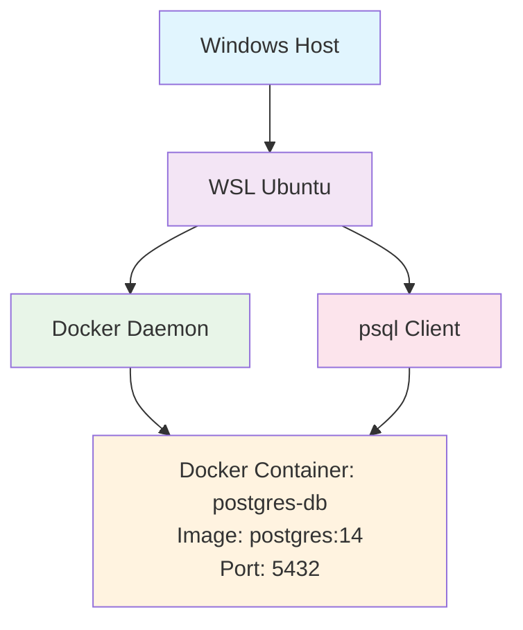

## Installing Docker and PostgreSQL on Ubuntu WSL

Follow these step-by-step instructions to install Docker and PostgreSQL on your Ubuntu WSL instance. Ensure you're running WSL 2 for full Docker support.

### Current Setup Overview



**Your Environment:**
- PostgreSQL runs in Docker container (not native Ubuntu service)
- Container name: `postgres-db`
- Database: `hapa`, User: `hapa`, Password: `hapa`
- Port: 5432 (exposed to localhost)

### Prerequisites
- Ubuntu 20.04 or later
- WSL 2 enabled
- Internet connection
- Sudo privileges

### Step 1: Update System Packages
```bash
sudo apt update
sudo apt upgrade -y
```

### Step 2: Install Docker

#### Install Prerequisites
```bash
sudo apt install apt-transport-https ca-certificates curl gnupg lsb-release -y
```

#### Add Docker's Official GPG Key
```bash
curl -fsSL https://download.docker.com/linux/ubuntu/gpg | sudo gpg --dearmor -o /usr/share/keyrings/docker-archive-keyring.gpg
```

#### Add Docker Repository
```bash
echo "deb [arch=$(dpkg --print-architecture) signed-by=/usr/share/keyrings/docker-archive-keyring.gpg] https://download.docker.com/linux/ubuntu $(lsb_release -cs) stable" | sudo tee /etc/apt/sources.list.d/docker.list > /dev/null
```

#### Update Package Index and Install Docker
```bash
sudo apt update
sudo apt install docker-ce docker-ce-cli containerd.io -y
```

#### Start and Enable Docker Service
```bash
sudo systemctl start docker
sudo systemctl enable docker
```

#### Add Your User to Docker Group (Optional, for non-sudo usage)
```bash
sudo usermod -aG docker $USER
# Log out and back in, or run: newgrp docker
```

#### Verify Docker Installation
```bash
docker --version
docker run hello-world
```

### Step 3: Install PostgreSQL

#### Install PostgreSQL
```bash
sudo apt install postgresql postgresql-contrib -y
```

#### Start and Enable PostgreSQL Service
```bash
sudo systemctl start postgresql
sudo systemctl enable postgresql
```

#### Verify PostgreSQL Installation
```bash
psql --version
sudo systemctl status postgresql
```

### Step 4: Configure PostgreSQL

#### Switch to PostgreSQL User
```bash
sudo -u postgres psql
```

#### In PostgreSQL Shell, Create a Database and User
```sql
CREATE DATABASE hapa;
CREATE USER hapa WITH ENCRYPTED PASSWORD 'hapa';
GRANT ALL PRIVILEGES ON DATABASE hapa TO hapa;
\q
```

#### (Optional) Allow Local Connections Without Password
Edit `/etc/postgresql/14/main/pg_hba.conf` (adjust version if needed):
```bash
sudo nano /etc/postgresql/14/main/pg_hba.conf
```
Change the local line from `peer` to `md5` or `trust` for development.

#### Restart PostgreSQL
```bash
sudo systemctl restart postgresql
```

### Step 5: Test Connections

#### Connect to PostgreSQL as New User
```bash
psql -h localhost -U myuser -d mydatabase
# Enter password when prompted
```

#### In PostgreSQL Shell
```sql
CREATE TABLE test (id SERIAL PRIMARY KEY, name VARCHAR(50));
INSERT INTO test (name) VALUES ('Hello World');
SELECT * FROM test;
\q
```

### Step 6: Using Docker with PostgreSQL (Alternative)

If you prefer Docker for PostgreSQL:

#### Pull and Run PostgreSQL Container
```bash
docker run --name postgres-db -e POSTGRES_PASSWORD=hapa -e POSTGRES_DB=hapa -e POSTGRES_USER=hapa -p 5432:5432 -d postgres:14
```

#### Connect to Docker PostgreSQL
```bash
docker exec -it postgres-db psql -U hapa -d hapa
```

### WSL-Specific Notes
- Docker Desktop for Windows can manage WSL 2 containers; install it for GUI management.
- For file sharing between WSL and Docker, use `/mnt/c` paths carefully.
- If Docker fails to start, ensure WSL 2 is enabled: `wsl --set-default-version 2`
- PostgreSQL data persists in `/var/lib/postgresql/data` for native install, or in Docker volumes.

### Troubleshooting
- **Docker permission denied**: Run with `sudo` or add user to docker group and restart session.
- **PostgreSQL connection refused**: Check if service is running (`sudo systemctl status postgresql`) and firewall settings.
- **Port conflicts**: Ensure ports 5432 (PostgreSQL) are not in use by other services.
- **WSL networking**: Use `localhost` or `127.0.0.1` for connections within WSL.
- **Docker TLS certificate error (x509: certificate signed by unknown authority)**: This often occurs behind corporate proxies/firewalls that intercept SSL traffic. Common solutions:

  #### 1. Check System Time (Most Common Fix)
  Incorrect system time causes certificate validation failures:
  ```bash
  date
  ```
  If wrong, sync time:
  ```bash
  sudo hwclock -s  # On WSL, use this
  # OR restart WSL from Windows PowerShell:
  wsl --shutdown
  ```

  #### 2. Configure Docker for Insecure Registries
  Edit `/etc/docker/daemon.json`:
  ```bash
  sudo nano /etc/docker/daemon.json
  ```
  Add (remove any invalid options like "insecure-skip-verify"):
  ```json
  {
    "insecure-registries": ["docker.io"]
  }
  ```
  **Note:** `"insecure-skip-verify"` is NOT a valid Docker daemon option.

  #### 3. Restart Docker Service
  ```bash
  sudo systemctl daemon-reload
  sudo systemctl restart docker
  ```

  #### 4. Configure Corporate Proxy (if applicable)
  Add to `/etc/docker/daemon.json`:
  ```json
  {
    "insecure-registries": ["docker.io"],
    "proxies": {
      "default": {
        "httpProxy": "http://proxy.company.com:8080",
        "httpsProxy": "http://proxy.company.com:8080",
        "noProxy": "localhost,127.0.0.1"
      }
    }
  }
  ```

  #### 5. Validate daemon.json Syntax
  Always check JSON syntax before restarting:
  ```bash
  sudo python3 -c "import json; json.load(open('/etc/docker/daemon.json'))"
  ```

- **Docker daemon fails to start**: Check logs with `sudo journalctl -xeu docker.service`
- **psql syntax errors**: Always terminate SQL commands with `;` - incomplete commands show `->` prompt
- **Permission denied for schema public**: Grant permissions: `GRANT ALL PRIVILEGES ON SCHEMA public TO username;`

### Useful Commands After Installation

#### Docker
- `docker ps -a` — List all containers
- `docker images` — List images
- `docker logs container_name` — View container logs
- `docker stop/start container_name` — Control containers

#### PostgreSQL
- `sudo -u postgres psql` — Access PostgreSQL as admin
- `psql -U username -d database` — Connect as specific user
- `psql -h localhost -U hapa -d hapa` — Connect to Docker PostgreSQL
- `\l` — List databases
- `\c database` — Switch database
- `\dt` — List tables
- `\q` — Quit psql

### Common psql Issues and Solutions

#### 1. Continuation Prompt (`->`)
**Problem:** Commands not executing, showing `->` prompt
**Cause:** Missing semicolon or incomplete command
**Solution:** Type `;` and press Enter, or `\q` to quit and restart

#### 2. Permission Denied for Schema Public
**Problem:** `ERROR: permission denied for schema public`
**Cause:** User lacks permissions on the public schema
**Solution:**
```sql
GRANT ALL PRIVILEGES ON SCHEMA public TO username;
```

#### 3. Connection Refused
**Problem:** `psql: could not connect to server`
**Cause:** PostgreSQL not running or wrong connection details
**Solution:** Check `docker ps` for container status, verify port 5432

#### 4. Syntax Error at or near "SELECT"
**Problem:** Multiple commands entered without proper separation
**Solution:** Enter one command at a time, always end with `;`

### Your Current Working Setup

Based on your troubleshooting session, here's what worked:

1. **Docker Configuration:** Use only `"insecure-registries": ["docker.io"]` in `/etc/docker/daemon.json`
2. **Time Sync:** Run `wsl --shutdown` from Windows PowerShell to sync time
3. **PostgreSQL:** Running in Docker container `postgres-db` with credentials:
   - User: `hapa`
   - Password: `hapa`
   - Database: `hapa`
   - Port: `5432`

**Quick Start Commands:**
```bash
# Check Docker containers
docker ps

# Connect to PostgreSQL
psql -h localhost -U hapa -d hapa

# Create and test table
CREATE TABLE test (id SERIAL PRIMARY KEY, name VARCHAR(50));
INSERT INTO test (name) VALUES ('Hello World');
SELECT * FROM test;
```
